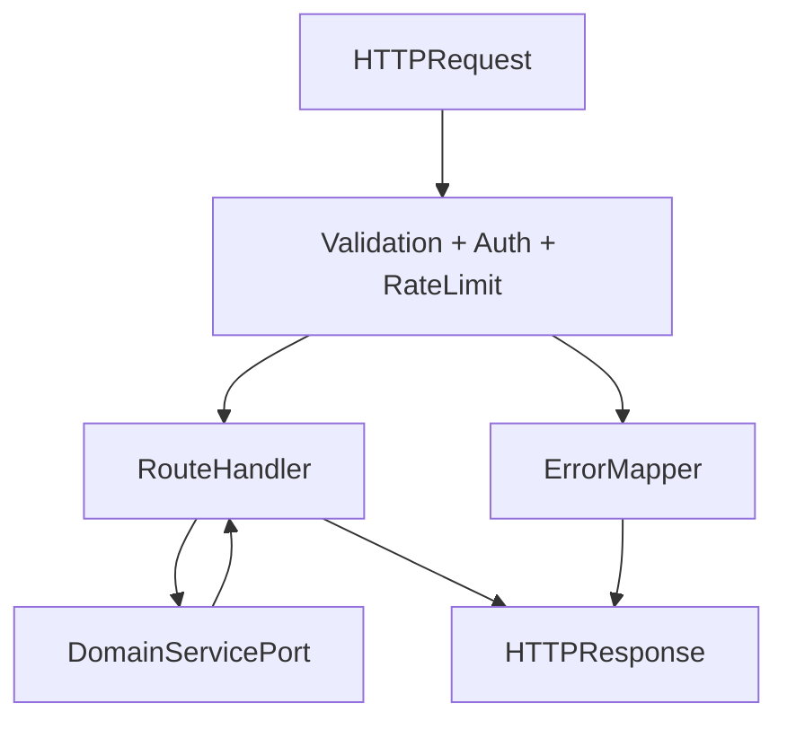
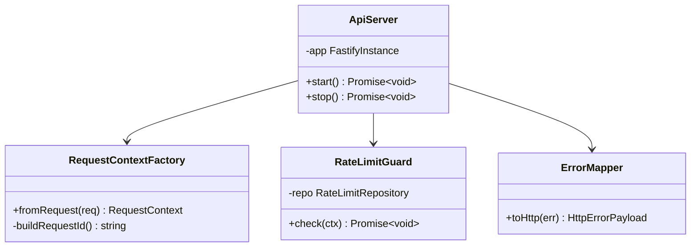

# API Edge Module

## Features
**Can do**
- Route registration and request lifecycle orchestration.
- Input validation, auth guard invocation, error translation.
- CORS, rate limiting, idempotency handling, request tracing.
- Health/readiness endpoint handling.

**Does not do**
- Document/domain business logic.
- Ownership decisions or settings logic.
- Long-term data modeling for domain entities.

## Internal Architecture
The API edge is the composition root. It wires middleware, controllers, and domain service ports.

### Design Justification
- Keeps HTTP/framework concerns separate from domain logic.
- Enables domain testing without HTTP stack dependency.
- Supports incremental hardening (rate limits, idempotency) at a single edge point.

## Data Abstractions
- `RequestContext`: `requestId`, `actorSub`, `scopes`, trace metadata
- `ApiError`: typed hierarchy mapped to deterministic HTTP responses

## Stable Storage Mechanism
PostgreSQL operational tables (phased):
- Required now: `api_audit_events`
- Optional later (endpoint-driven): `api_idempotency_keys`
- Rate limiting persistence is not required in V1; prefer edge controls (ALB/WAF) or in-process guard for low traffic.

## Storage Schemas
- `api_audit_events(id uuid pk, actor_sub text, route text, method text, status_code int, created_at timestamptz, payload_hash text)`
- `api_idempotency_keys(key text pk, actor_sub text, route text, response_code int, response_body jsonb, expires_at timestamptz)` (optional, when endpoint idempotency is required)

## External REST API
- `GET /health`
- `GET /ready`

## Classes, Methods, Fields
- **Public** `ApiServer`
  - `public start(): Promise<void>`
  - `public stop(): Promise<void>`
  - `private app: FastifyInstance`
- **Public** `RequestContextFactory`
  - `public fromRequest(req): RequestContext`
  - `private buildRequestId(): string`
- **Public** `RateLimitGuard`
  - `public check(ctx: RequestContext): Promise<void>`
  - `private repo: RateLimitRepository`
- **Private** `ErrorMapper`
  - `public toHttp(err: unknown): HttpErrorPayload`

## Class Hierarchy Diagram

