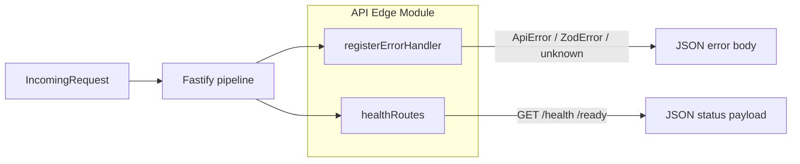
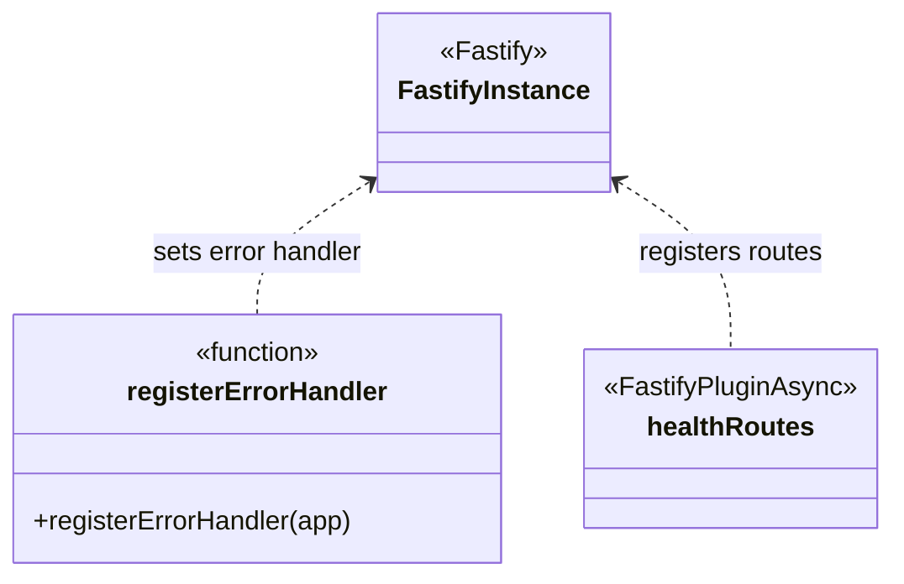

# API Edge Module

**Code path:** `backend/src/modules/api-edge/`

This module is the HTTP **cross-cutting surface** for consistent errors and platform health. It does **not** register domain routes; `buildApp` in `backend/src/app.ts` composes Fastify plugins from domain modules alongside this one.

## Features

**What it does**
- Registers a **global Fastify error handler** that maps typed application errors and validation failures to stable JSON responses.
- Exposes **liveness** (`GET /health`) and **readiness** (`GET /ready`) routes for orchestrators and load balancers.

**What it does not do**
- Authentication, authorization, or session handling (see [Identity and Access Module](identity-access-module.md)).
- Domain rules for documents or settings.
- **Auth route rate limiting** is implemented in-process (sliding window per IP) under `backend/src/modules/api-edge/in-memory-sliding-window-rate-limit.ts` and used from identity route plugins—not in this folder. It is per process, not distributed; see [system.md](../system.md) and the [AWS deployment runbook](../../deployment/aws-amplify-apigw-lambda-auth-runbook.md).
- Request tracing middleware or idempotency storage.
- Audit persistence (see [Operational Store Module](operational-store-module.md); wired separately in `app.ts`).

## Internal architecture

The module is intentionally small: two exported units with no shared internal state. The composition root (`buildApp`) registers `registerErrorHandler` once, then mounts `healthRoutes` as a Fastify plugin.

### Design justification (senior review)

- **Single error handler** centralizes response shape (`code`, `message`, `requestId`) so domain modules can throw `ApiError` or rely on Zod without duplicating HTTP mapping.
- **Health vs readiness** are split so you can later make `/ready` depend on DB or JWKS without changing liveness semantics.
- **No faux “API server” class** keeps the module aligned with Fastify’s plugin model and avoids an extra abstraction layer that the repo does not use.

Related cross-cutting types live outside this folder: `RequestContext` and `createRequestContext` are in `backend/src/shared/request-context.ts` and are attached in `app.ts`’s `onRequest` hook.

## Data abstraction

- **Error mapping input:** `ApiError` (`backend/src/shared/api-error.ts`), `ZodError`, or any other `Error`.
- **No persistent domain entities** in this module.

## Stable storage mechanism

**None.** This module does not own durable state directly, but `/ready` now runs dependency checks against configured backends.

## Storage / wire schemas

**HTTP error body (non-Zod failure path)**

| Field | Type | Notes |
|-------|------|--------|
| `code` | string | e.g. `INTERNAL_ERROR` |
| `message` | string | Safe message for clients |
| `requestId` | string | Fastify request id |

**Zod validation error (`400`)**

| Field | Type | Notes |
|-------|------|--------|
| `code` | `"VALIDATION_ERROR"` | Fixed |
| `message` | string | Fixed summary |
| `requestId` | string | |
| `details` | array | Zod `issues` |

**Health**

- `GET /health` → `{ "status": "ok" }`
- `GET /ready` → `{ "status": "ready", "checks": [...] }` when dependency checks pass
- `GET /ready` → `503` with `{ "status": "not_ready", "checks": [...] }` when any dependency fails

Current readiness checks:
- PostgreSQL (`select 1`) when `DATABASE_URL` is configured
- Auth session store health via `authSessionStore.healthCheck()` when available

## External API (callers of this module)

Other backend code does not “call” the API edge as a library; it **registers** these hooks/routes on a `FastifyInstance`. The **HTTP surface** this module adds is:

| Method | Path | Auth |
|--------|------|------|
| `GET` | `/health` | Public |
| `GET` | `/ready` | Public |

## Declarations (TypeScript)

### `error-handler.ts`

| Symbol | Kind | Visibility | Notes |
|--------|------|------------|--------|
| `registerErrorHandler` | function | **Exported** — public API of this file | Registers `app.setErrorHandler(...)`. |

**Module-private:** none (single export).

### `health-routes.ts`

| Symbol | Kind | Visibility | Notes |
|--------|------|------------|--------|
| `healthRoutes` | `FastifyPluginAsync` | **Exported** — public API of this file | Registers `/health` and `/ready`. |

**Module-private:** none.

## Class hierarchy (module-internal)

This module has **no classes**. Relationships are “registers on” Fastify:

