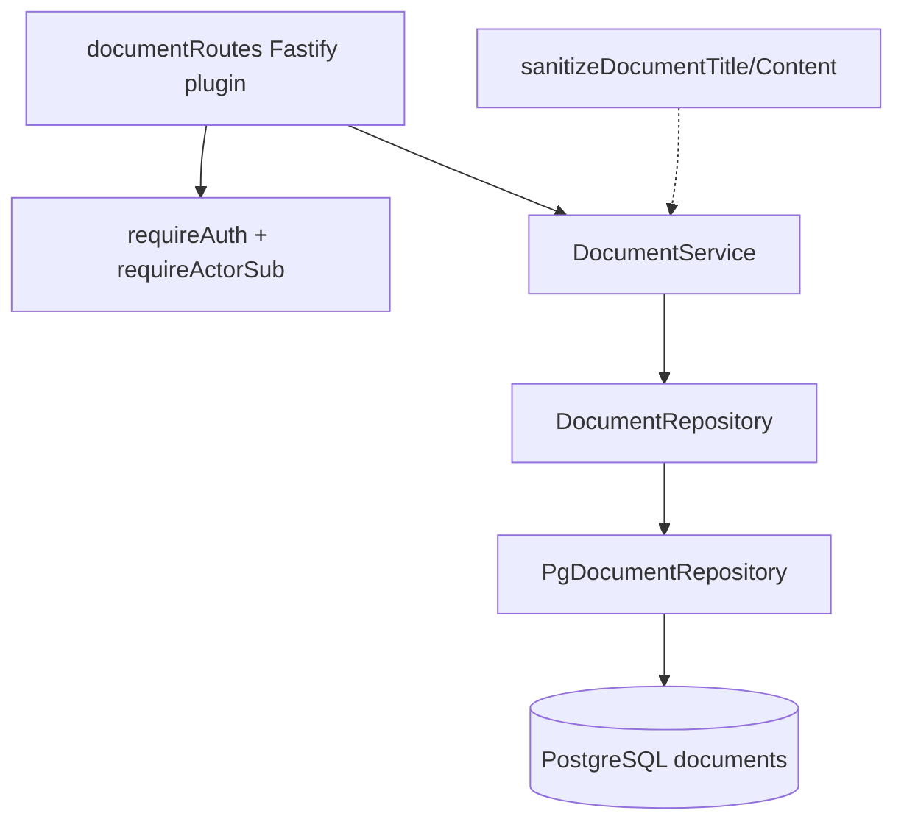
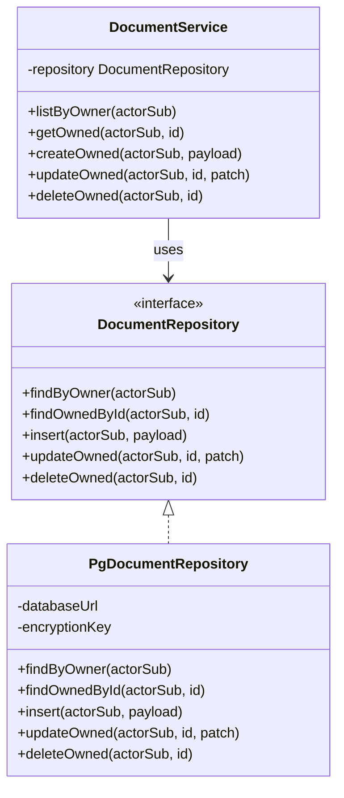

# Document Module

**Code path:** `backend/src/modules/documents/`

Owns **user-scoped rich-text documents and folders**: create, list, read, update, delete. Enforces **ownership** with `owner_id = actorSub` on every query. Applies **HTML sanitization** on write via `DocumentService` (`backend/src/shared/document-sanitizer.ts`). Legacy `` tags from rich-text commands allow **face** and **color** only (not **style**, to keep URL-based CSS vectors out of stored content). Optional **AES-GCM encryption** for document `title` and `content` at rest when `DOCUMENT_ENCRYPTION_KEY` is set (`PgDocumentRepository` + `backend/src/shared/document-encryption.ts`).

## Features

**What it does**
- CRUD for documents keyed by authenticated **`actorSub`** (stored as `owner_id`).
- CRUD for nested folders keyed by authenticated **`actorSub`**.
- Validates **language** against `SUPPORTED_DOCUMENT_LANGUAGES` in `backend/src/shared/document-languages.ts` at the HTTP (Zod) and DB `CHECK` constraint level (see the most recent migration that alters `documents_language_check` under `backend/migrations/`, currently `012_extend_documents_language_check_for_sv_nb_tr.js`).
- Sanitizes **title** (plain text) and **content** (allowlisted HTML) before persistence.
- Lists documents for an owner ordered by **`updated_at` descending**.
- Supports optional `folderId` on documents; folder deletion reparents direct child folders/documents to the deleted folder parent.
- Supports optional per-document `fontFamily` constrained to a shared font catalog.
- Encrypts title/content in the repository layer when an encryption key is configured.

**What it does not do**
- Real-time collaboration, OT/CRDT, or locking.
- Full-text search or secondary indexes on body text.
- Sharing or ACLs beyond single-owner rows.
- File/blob storage for attachments (images are embedded as data URLs in HTML after frontend constraints).

## Internal architecture

### Design justification (senior review)

- **`DocumentRepository` interface** enables unit tests of `DocumentService` with an in-memory fake without PostgreSQL.
- **Sanitization in the service layer** keeps routes thin and guarantees no repository bypasses policy.
- **Encryption at the repository** keeps SQL unaware of plaintext shape; ciphertext is still `text` in PostgreSQL.
- **404 for missing or cross-tenant id** avoids leaking existence of other users’ UUIDs.

## Data abstractions

| Type | Purpose |
|------|---------|
| `DocumentAggregate` | API/repository result: `id`, `ownerId`, `title`, `content`, `language`, optional `folderId`, optional `fontFamily`, ISO8601 `createdAt`/`updatedAt`. |
| `FolderAggregate` | API/repository result: `id`, `ownerId`, `name`, optional `parentFolderId`, timestamps. |
| `CreateDocumentDto` | `title`, `content`, `language`, optional `folderId`, optional `fontFamily`. |
| `UpdateDocumentDto` | Optional `title`, `content`, `language`, `folderId`, `fontFamily`. |
| `CreateFolderDto` / `UpdateFolderDto` | Folder name and optional parent updates. |
| `DocumentRepository` | Persistence port for documents and folders (CRUD + hierarchy validation helpers). |
| `DocumentLanguage` | Union type from `shared/document-languages.ts`. |

## Stable storage mechanism

**PostgreSQL** table **`documents`** — durable across process restarts. All document state lives here for authenticated API usage.

## Storage schema (PostgreSQL)

**Table `documents`** (from migrations)

| Column | Type | Notes |
|--------|------|--------|
| `id` | `uuid` | PK, `gen_random_uuid()` |
| `owner_id` | `text` | OIDC subject (`sub`) from authenticated principal |
| `title` | `text` | Plain text after sanitization; may be ciphertext |
| `content` | `text` | Sanitized HTML; may be ciphertext |
| `language` | `text` | `CHECK` (`documents_language_check`); allowed codes match `SUPPORTED_DOCUMENT_LANGUAGES` (see the latest `*_extend_documents_language_check*.js` migration in `backend/migrations/`) |
| `folder_id` | `uuid` | Nullable FK to `folders.id` |
| `font_family` | `text` | Nullable font family from shared catalog |
| `created_at` | `timestamptz` | |
| `updated_at` | `timestamptz` | Bumped on update |

**Indexes:** `(owner_id, updated_at)`, `(id, owner_id)`, `(owner_id, folder_id)`.

**Table `folders`** (from migrations)

| Column | Type | Notes |
|--------|------|--------|
| `id` | `uuid` | PK, `gen_random_uuid()` |
| `owner_id` | `text` | OIDC subject (`sub`) from authenticated principal |
| `name` | `text` | Plain text folder name |
| `parent_folder_id` | `uuid` | Nullable FK to `folders.id` |
| `created_at` | `timestamptz` | |
| `updated_at` | `timestamptz` | Bumped on update |

**Folder indexes:** `(owner_id, parent_folder_id)`, `(owner_id, updated_at)`.

## External HTTP API

| Method | Path | Body | Response |
|--------|------|------|----------|
| `GET` | `/documents` | — | `DocumentAggregate[]` |
| `GET` | `/documents/:id` | — | `DocumentAggregate` or `404` |
| `POST` | `/documents` | `CreateDocumentDto` (Zod) | `201` + aggregate |
| `PUT` | `/documents/:id` | Partial update (≥1 field) | aggregate or `404` |
| `DELETE` | `/documents/:id` | — | `204` or `404` |
| `GET` | `/folders` | — | `FolderAggregate[]` |
| `GET` | `/folders/:id` | — | `FolderAggregate` or `404` |
| `POST` | `/folders` | `CreateFolderDto` (Zod) | `201` + aggregate |
| `PUT` | `/folders/:id` | Partial update (≥1 field) | aggregate or `404` |
| `DELETE` | `/folders/:id` | — | `204` or `404` |

**Auth:** `requireAuth` + `requireActorSub` on all routes.

**Zod:** `id` param must be UUID string.

## Font catalog extensibility

Font validation in backend is data-driven via `backend/src/shared/document-fonts.ts`.
Additions should follow this checklist:

1. Add/adjust catalog entry in `backend/src/shared/document-fonts.ts`.
2. Mirror the frontend catalog entry in `src/app/utils/language-fonts.ts`.
3. Keep defaults aligned (`defaultFamily` present in each language font list).
4. Extend tests in `backend/test/document-routes.test.ts`, `backend/test/document-service.test.ts`, and `src/test/editor-fonts.test.tsx`.

## Declarations (TypeScript)

### `types.ts` — exported

- `DocumentAggregate`, `CreateDocumentDto`, `UpdateDocumentDto`, re-export `DocumentLanguage`.

### `document-repository.ts` — exported

| Symbol | Visibility |
|--------|------------|
| `DocumentRepository` interface | **Exported** |
| Methods `findByOwner`, `findOwnedById`, `insert`, `updateOwned`, `deleteOwned` | **Exported** (interface) |

### `document-service.ts`

| Symbol | Visibility |
|--------|------------|
| `DocumentService` class | **Exported** |
| `repository` | **private** field |
| `listByOwner`, `getOwned`, `createOwned`, `updateOwned`, `deleteOwned` | **public** methods |

### `pg-document-repository.ts`

| Symbol | Visibility |
|--------|------------|
| `PgDocumentRepositoryOptions` | **Exported** |
| `PgDocumentRepository` class | **Exported** |
| `databaseUrl`, `encryptionKey` | **private** fields |
| `findByOwner`, `findOwnedById`, `insert`, `updateOwned`, `deleteOwned` | **public** methods |
| `DocumentRow` interface, `toAggregate` function | **Not exported** (file-private) |

### `document-routes.ts`

| Symbol | Visibility |
|--------|------------|
| `documentRoutes` | **Exported** (`FastifyPluginAsync`) |
| Zod schemas `createDocumentSchema`, `updateDocumentSchema`, `paramsSchema` | **Not exported** |

## Class hierarchy (module-internal)

