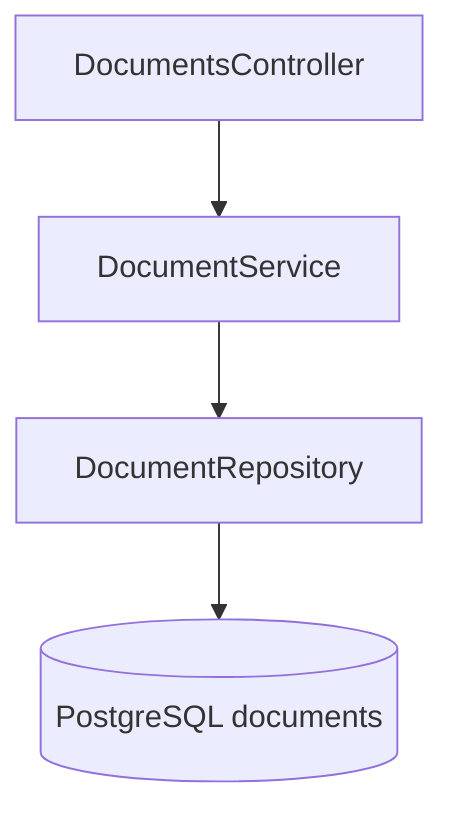
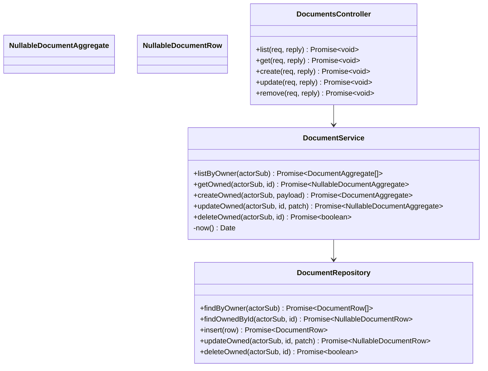

# Document Module

## Features
**Can do**
- Create/list/read/update/delete documents for authenticated users.
- Enforce strict ownership for all reads/writes.
- Persist title/content/language with creation and update timestamps.

**Does not do**
- Realtime collaboration.
- Operational transform / CRDT merge logic.
- Full-text indexing/search in V1.

## Internal Architecture

### Design Justification
- Service layer centralizes invariants (ownership, timestamp policy).
- Repository isolates SQL and supports deterministic tests.
- Controller remains thin and transport-focused.

## Data Abstractions
- `DocumentAggregate`
  - `id`, `ownerId`, `title`, `contentHtml`, `language`, `createdAt`, `updatedAt`
- `DocumentPatch`
  - partial update DTO (`title`, `content`, `language`)

## Stable Storage Mechanism
- PostgreSQL `documents` table.

## Storage Schemas
- `documents(id uuid pk, owner_id text not null, title text not null, content text not null, language text not null, created_at timestamptz not null, updated_at timestamptz not null)`
- Indexes:
  - `idx_documents_owner_updated(owner_id, updated_at desc)`
  - `idx_documents_id_owner(id, owner_id)`

## External REST API
- `GET /documents`
- `GET /documents/:id`
- `POST /documents`
- `PUT /documents/:id`
- `DELETE /documents/:id`

## Classes, Methods, Fields
- **Public** `DocumentsController`
  - `public list(req, reply): Promise<void>`
  - `public get(req, reply): Promise<void>`
  - `public create(req, reply): Promise<void>`
  - `public update(req, reply): Promise<void>`
  - `public remove(req, reply): Promise<void>`
- **Public** `DocumentService`
  - `public listByOwner(actorSub: string): Promise<DocumentAggregate[]>`
  - `public getOwned(actorSub: string, id: string): Promise<DocumentAggregate | null>`
  - `public createOwned(actorSub: string, payload: CreateDocumentDto): Promise<DocumentAggregate>`
  - `public updateOwned(actorSub: string, id: string, patch: UpdateDocumentDto): Promise<DocumentAggregate | null>`
  - `public deleteOwned(actorSub: string, id: string): Promise<boolean>`
  - `private now(): Date`
- **Public** `DocumentRepository`
  - `public findByOwner(actorSub: string): Promise<DocumentRow[]>`
  - `public findOwnedById(actorSub: string, id: string): Promise<DocumentRow | null>`
  - `public insert(row: NewDocumentRow): Promise<DocumentRow>`
  - `public updateOwned(actorSub: string, id: string, patch: PartialDocumentRow): Promise<DocumentRow | null>`
  - `public deleteOwned(actorSub: string, id: string): Promise<boolean>`

`actorSub` is mapped to `owner_id` in SQL predicates.

## Class Hierarchy Diagram

