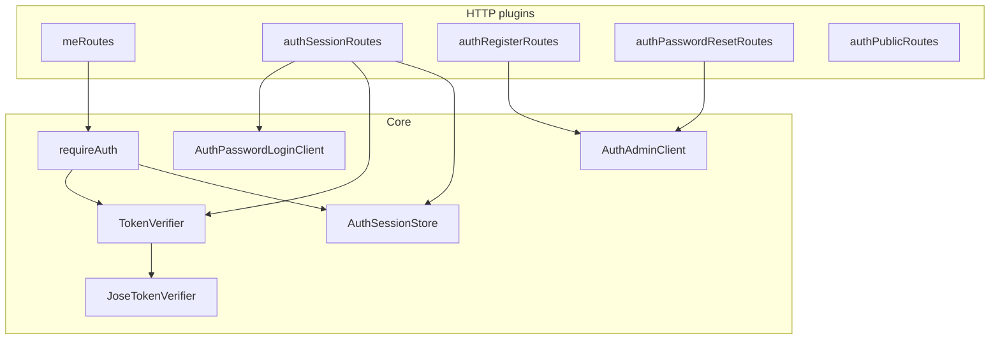
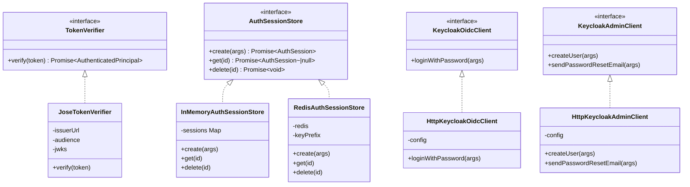

# Identity and Access Module

**Code path:** `backend/src/modules/identity-access/`

This module verifies **OIDC access tokens** (JWT), resolves an **`AuthenticatedPrincipal`**, supports **cookie-backed server sessions** that hold the access token server-side, and orchestrates a provider adapter (local dev Keycloak, production Cognito) for login, registration, and password-reset flows. It does **not** store or hash passwords in GlossaDocs.

## Features

**What it does**
- Verifies JWTs with **issuer**, **audience**, **signature** (JWKS), and required **`sub`** (`JoseTokenVerifier`).
- Resolves **`AuthenticatedPrincipal`**: `actorSub` (from `sub`), `username`, `email`, `scopes`.
- **`requireAuth`**: loads access token from **session cookie** (via `AuthSessionStore`) or **`Authorization: Bearer`**; verifies token; sets `request.principal` and extends `request.requestContext`.
- **`requireActorSub`**: returns `actorSub` or throws `401` if missing.
- **Session routes:** `POST /auth/login`, `POST /auth/logout`, `GET /auth/session` (cookie session).
- **Provider-based app login** via `AuthPasswordLoginClient` adapters (`HttpKeycloakOidcClient` or `HttpCognitoOidcClient`).
- **Registration** via `AuthAdminClient` adapters (`HttpKeycloakAdminClient` or `HttpCognitoAdminClient`).
- **Password reset email** via provider admin APIs behind `AuthAdminClient`.
- **Public OIDC discovery helper:** `GET /auth/public` (optional URLs for alternate frontends).
- **Profile:** `GET /me` (Bearer or session, same verifier).

**What it does not do**
- Persist GlossaDocs-owned user passwords or credentials.
- Issue or sign JWTs (identity provider does).
- Authorization beyond “authenticated + `actorSub`” (resource ownership lives in document/settings repositories).

## Internal architecture

### Design justification (senior review)

- **TokenVerifier interface** allows tests to inject a fake verifier while production uses JWKS-backed verification.
- **Session cookie stores only an opaque session id**; the access token lives in **Redis or memory** (`AuthSessionStore`), reducing token exposure if `httpOnly` is misconfigured and aligning TTL with the provider token expiry.
- **Bearer fallback** supports tooling and non-browser clients without cookies.
- **Auth provider adapters** isolate IdP-specific API details from route handlers.
- **Production (`APP_ENV=prod`) forbids in-memory session store** and requires secure cookie/CORS posture.

## Data abstractions

| Abstraction | Role |
|-------------|------|
| `AuthenticatedPrincipal` | Runtime user identity after token verification. |
| `TokenVerifier` | Contract: `verify(token) → AuthenticatedPrincipal`. |
| `AuthSession` | Opaque `id`, `accessToken`, `expiresAt` (ms). |
| `AuthSessionStore` | `create`, `get`, `delete` for sessions. |
| `AuthPasswordLoginClient` | App-hosted username/password login adapter. |
| `AuthAdminClient` | Create user and password-reset adapter. |

## Stable storage mechanisms

| Mechanism | Durability | Used for |
|-----------|------------|----------|
| **Identity provider store** | Durable (IdP) | User accounts, passwords, reset workflows |
| **Redis** (`RedisAuthSessionStore`) | Durable | Session records when `AUTH_SESSION_STORE=redis` |
| **`InMemoryAuthSessionStore`** | **Lost on process restart** | Dev/test only; **blocked in production** in `buildApp` |

No GlossaDocs-owned `user_profiles` table exists in this module; identity source of truth is the configured IdP.

## Storage schemas (session backends)

**In-memory / Redis value (logical)**

| Field | Notes |
|-------|--------|
| Session id | UUID string (cookie value) |
| `accessToken` | JWT string from the configured identity provider |
| TTL | Redis `SET` with `EX`; memory uses `expiresAt` |

**Redis key:** `{AUTH_REDIS_KEY_PREFIX}{sessionId}` (default prefix `glossadocs:session:`).

## External HTTP API (this module’s routes)

| Method | Path | Auth | Behavior summary |
|--------|------|------|------------------|
| `GET` | `/auth/public` | Public | Returns OIDC client metadata URLs if `OIDC_PUBLIC_*` configured. |
| `POST` | `/auth/login` | Public | Body `{ username, password }`; sets httpOnly session cookie; returns `{ user }`. Requires `AuthPasswordLoginClient`. |
| `POST` | `/auth/logout` | Cookie | Deletes session server-side; clears cookie. |
| `GET` | `/auth/session` | Cookie | Returns `{ user }` if session valid. |
| `POST` | `/auth/register` | Public | Body `{ email, password }`; requires `AuthAdminClient`. |
| `POST` | `/auth/password-reset` | Public | Body `{ email }`; generic success message (no account enumeration). |
| `GET` | `/me` | Session or Bearer | Returns `{ sub, username, email, scopes }`. |

**Programmatic API for other modules:** `requireAuth(request, reply, tokenVerifier)` as `preHandler`, then `requireActorSub(request)` inside handlers.

## Declarations (TypeScript)

### `token-verifier.ts` — exported

| Symbol | Kind | Visibility |
|--------|------|------------|
| `AuthenticatedPrincipal` | interface | **Exported** |
| `actorSub`, `username`, `email`, `scopes` | fields | **Exported** (interface members) |
| `TokenVerifier` | interface | **Exported** |
| `verify(token: string)` | method | **Exported** (interface) |

### `jose-token-verifier.ts`

| Symbol | Visibility |
|--------|------------|
| `JoseVerifierOptions` | **Not exported** (module-private interface) |
| `JoseTokenVerifier` class | **Exported** |
| `issuerUrl`, `audience`, `jwks` | **private** fields |
| `verify` | **public** method |

### `auth.ts`

| Symbol | Visibility |
|--------|------------|
| `requireAuth` | **Exported** |
| `extractBearerToken` | **Not exported** (file-private function) |

### `current-actor.ts`

| Symbol | Visibility |
|--------|------------|
| `requireActorSub` | **Exported** |

### `auth-session-store.ts`

| Symbol | Visibility |
|--------|------------|
| `AuthSession` interface | **Exported** |
| `AuthSessionStore` interface | **Exported** |
| `InMemoryAuthSessionStore` class | **Exported** |
| `sessions` (`Map`) | **private** on `InMemoryAuthSessionStore` |
| `create`, `get`, `delete` | **public** methods |

### `redis-auth-session-store.ts`

| Symbol | Visibility |
|--------|------------|
| `RedisAuthSessionStoreOptions` | **Not exported** |
| `StoredSession` | **Not exported** |
| `RedisAuthSessionStore` class | **Exported** |
| `redis`, `keyPrefix` | **private** fields |
| `key(sessionId)` | **private** method |
| `create`, `get`, `delete` | **public** methods |

### `keycloak-oidc-client.ts`

| Symbol | Visibility |
|--------|------------|
| `KeycloakOidcClientErrorCode` | **Exported** (type) |
| `KeycloakOidcClientError` class | **Exported** (`code` **public** readonly) |
| `KeycloakPasswordLoginResult` | **Exported** |
| `KeycloakOidcClient` interface | **Exported** |
| `requireKeycloakOidcClientConfig` | **Exported** |
| `KeycloakOidcClientConfig` | **Not exported** |
| `TokenResponse` | **Not exported** |
| `HttpKeycloakOidcClient` class | **Exported** |
| `config` | **private** field |
| `loginWithPassword` | **public** method |

### `keycloak-admin-client.ts`

| Symbol | Visibility |
|--------|------------|
| `KeycloakAdminClientErrorCode`, `KeycloakAdminClientError` | **Exported** |
| `isKeycloakAdminErrorCode` | **Exported** |
| `KeycloakAdminClient` interface | **Exported** |
| `HttpKeycloakAdminClient` class | **Exported** |
| `KeycloakAdminClientConfig` | **Not exported** |
| `normalizeBaseUrl`, `getAdminAccessToken`, `keycloakRequest` | **Not exported** (module-private functions) |
| `requireKeycloakAdminConfig` | **Exported** |

### Route plugins (each file exports one plugin)

| Export | File |
|--------|------|
| `meRoutes` | `me-routes.ts` |
| `authPublicRoutes` | `auth-public-routes.ts` |
| `authSessionRoutes` | `auth-session-routes.ts` |
| `authRegisterRoutes` | `auth-register-routes.ts` |
| `authPasswordResetRoutes` | `auth-password-reset-routes.ts` |

**Module-private:** `buildAuthorizeUrl` in `auth-public-routes.ts`; `getCookieOptions` and Zod schemas in `auth-session-routes.ts`; `loginSchema`, `registerSchema`, `resetSchema` in respective route files.

### Fastify augmentation (`backend/src/shared/fastify-augment.d.ts`)

| Property | Owner | Visibility to TS |
|----------|--------|-------------------|
| `request.principal` | FastifyRequest | App-wide |
| `request.requestContext` | FastifyRequest | App-wide |
| `authSessionStore`, `authSessionCookieName` | FastifyInstance | App-wide |

## Class / interface hierarchy (module-internal)

