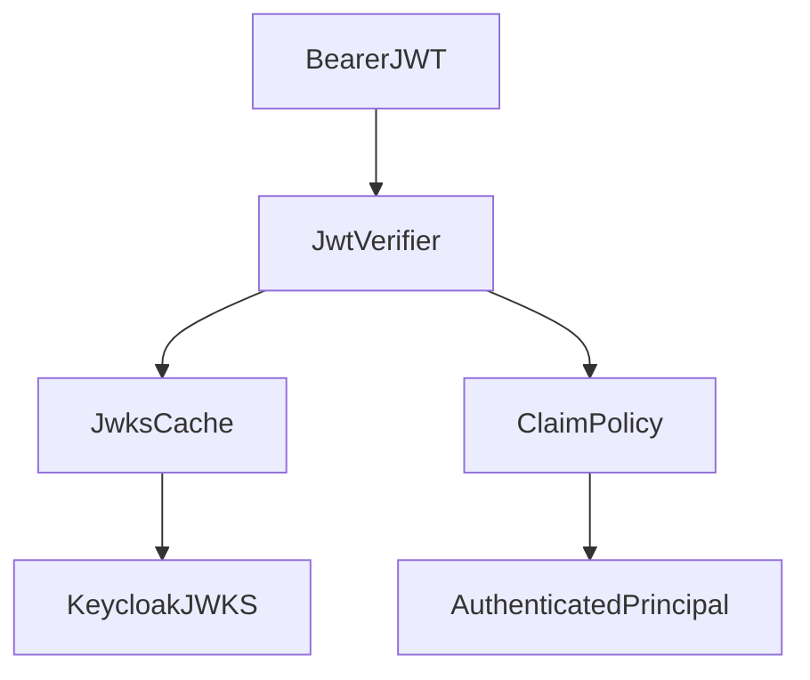
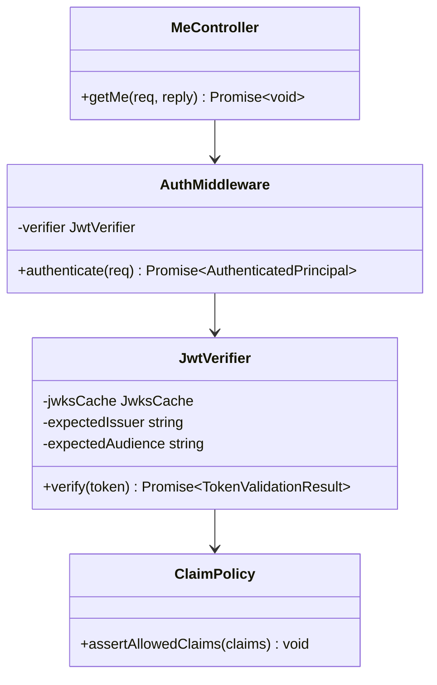

# Identity and Access Module

## Features
**Can do**
- Validate JWT signature, issuer, audience, and expiry.
- Build authenticated principal (`actorSub`, username, scopes).
- Expose frontend bootstrap endpoint (`/me`).
- Handle app-hosted auth routes (`/auth/login`, `/auth/logout`, `/auth/session`).
- Support app-hosted account creation and password reset orchestration.

**Does not do**
- Password storage or verification logic.
- Document mutation logic.

## Internal Architecture

### Design Justification
- Delegates credential risk to OIDC IdP (Keycloak), reducing app attack surface.
- JWKS caching improves availability and latency.
- Explicit claim policy avoids accidental permissive auth.

## Data Abstractions
- `AuthenticatedPrincipal { actorSub, username, email?, scopes[] }`
- `TokenValidationResult { principal, issuedAt, expiresAt }`

## Stable Storage Mechanism
- Keycloak realm DB (persistent) for identities and credentials.
- Optional app-side projection:
  - `user_profiles`

## Storage Schemas
- `user_profiles(sub text pk, username text, email text, created_at timestamptz, updated_at timestamptz)`

## External REST API
- `POST /auth/login` -> exchanges username/password with Keycloak and sets httpOnly session cookie
- `POST /auth/logout` -> clears session cookie
- `GET /auth/session` -> `{ user: { sub, username, email? } }`
- `GET /me` -> `{ sub, username, email, scopes }`

`/me.sub` is the external OIDC-standard field name. Internally this module maps `sub` to `AuthenticatedPrincipal.actorSub`.

## Classes, Methods, Fields
- **Public** `AuthMiddleware`
  - `public authenticate(req): Promise<AuthenticatedPrincipal>`
  - `private verifier: JwtVerifier`
- **Public** `JwtVerifier`
  - `public verify(token: string): Promise<TokenValidationResult>`
  - `private jwksCache: JwksCache`
  - `private expectedIssuer: string`
  - `private expectedAudience: string`
- **Public** `MeController`
  - `public getMe(req, reply): Promise<void>`
- **Private** `ClaimPolicy`
  - `public assertAllowedClaims(claims): void`

## Class Hierarchy Diagram

