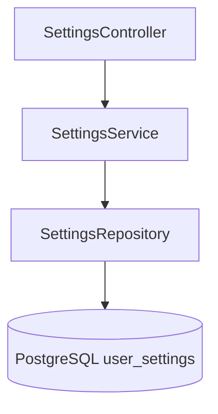
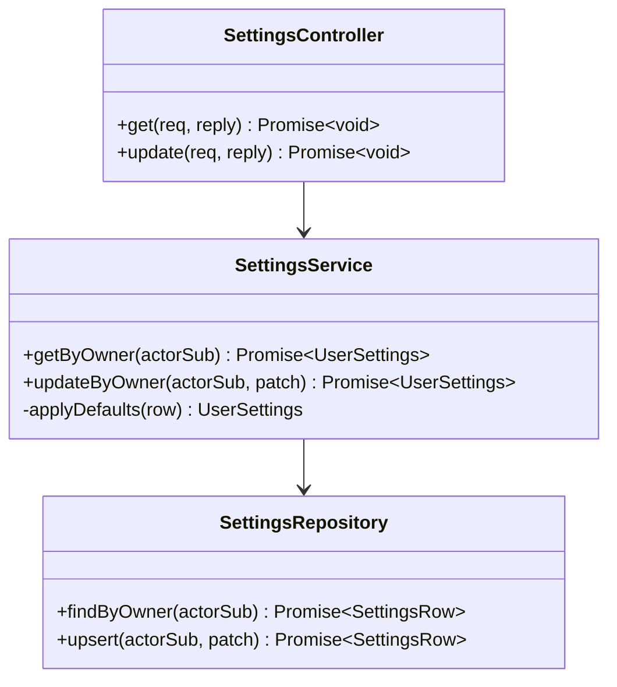

# Input Preferences Module

## Features
**Can do**
- Store and fetch per-user settings required by Story 3 and cross-story UX:
  - `keyboardVisible`
  - `lastUsedLocale`
- Expose typed settings read/update API.

**Does not do**
- Keyboard layout generation.
- Character insertion behavior in editor.
- Locale-to-layout algorithm decisions beyond persisted preference values.

## Internal Architecture

### Design Justification
- User settings are durable and cross-device when backend-backed.
- Strong typing on settings prevents key/value sprawl and migration drift.
- Small dedicated module avoids overloading document domain with preference concerns.

## Data Abstractions
- `UserSettings`
  - `lastUsedLocale: string`
  - `keyboardVisible: boolean`

## Stable Storage Mechanism
- PostgreSQL `user_settings` table.

## Storage Schemas
- `user_settings(owner_id text pk, last_used_locale text not null default 'en-US', keyboard_visible boolean not null default true, updated_at timestamptz not null)`

## External REST API
- `GET /settings` -> current user settings
- `PUT /settings` -> partial update (`lastUsedLocale`, `keyboardVisible`)

## Classes, Methods, Fields
- **Public** `SettingsController`
  - `public get(req, reply): Promise<void>`
  - `public update(req, reply): Promise<void>`
- **Public** `SettingsService`
  - `public getByOwner(actorSub: string): Promise<UserSettings>`
  - `public updateByOwner(actorSub: string, patch: UpdateSettingsDto): Promise<UserSettings>`
  - `private applyDefaults(row: SettingsRow | null): UserSettings`
- **Public** `SettingsRepository`
  - `public findByOwner(actorSub: string): Promise<SettingsRow | null>`
  - `public upsert(actorSub: string, patch: Partial<SettingsRow>): Promise<SettingsRow>`

`actorSub` is mapped to `owner_id` in SQL predicates.

## Class Hierarchy Diagram

