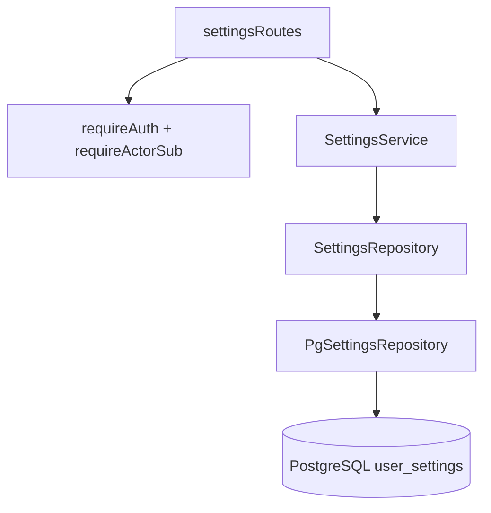
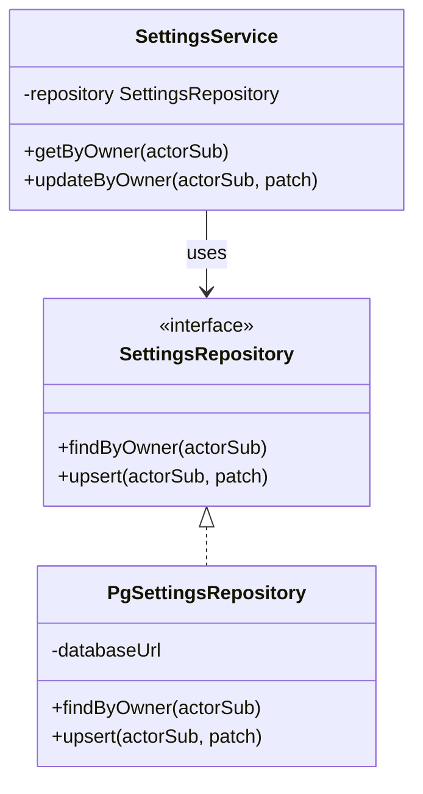

# Input Preferences Module

**Code path:** `backend/src/modules/input-preferences/`

Persists **per-user UI preferences** used by the editor: **`lastUsedLocale`** (string, e.g. `en-US`) and **`keyboardVisible`** (boolean). One logical row per **Keycloak subject** (`owner_id`).

## Features

**What it does**
- **`GET /settings`:** returns merged settings for the authenticated user (defaults if no row).
- **`PUT /settings`:** partial update — at least one of `lastUsedLocale` or `keyboardVisible`.
- Upserts into PostgreSQL on update (`ON CONFLICT (owner_id) DO UPDATE`).

**What it does not do**
- Define keyboard layouts or IME behavior (frontend concern).
- Validate locale strings against a fixed enumeration (stored as free-form `text` with Zod `min(2)` on update).
- Store document content or auth tokens.

## Internal architecture

### Design justification (senior review)

- **Separate module from documents** so editor preferences can evolve (new columns) without touching document migrations’ semantics.
- **`SettingsRepository` port** matches the document module pattern: test doubles without PostgreSQL.
- **Defaults in `findByOwner`** when no row exists avoids forcing a write on first `GET` and matches frontend expectations (`en-US`, keyboard visible).

## Data abstractions

| Type | Fields |
|------|--------|
| `UserSettings` | `lastUsedLocale: string`, `keyboardVisible: boolean` |
| `UpdateSettingsDto` | optional `lastUsedLocale`, `keyboardVisible` |
| `SettingsRepository` | `findByOwner(actorSub)`, `upsert(actorSub, patch)` |

## Stable storage mechanism

**PostgreSQL** table **`user_settings`**, one row per `owner_id` (primary key). Durable across restarts.

## Storage schema (PostgreSQL)

| Column | Type | Notes |
|--------|------|--------|
| `owner_id` | `text` | PK; Keycloak `sub` |
| `last_used_locale` | `text` | Not null, default `en-US` |
| `keyboard_visible` | `boolean` | Not null, default `true` |
| `updated_at` | `timestamptz` | Not null |

No separate module-owned migrations file reference beyond `backend/migrations/002_create_user_settings.js`.

## External HTTP API

| Method | Path | Body | Response |
|--------|------|------|----------|
| `GET` | `/settings` | — | `UserSettings` |
| `PUT` | `/settings` | `UpdateSettingsDto` (Zod; ≥1 field) | `UserSettings` |

**Auth:** session or Bearer via `requireAuth` (same as documents).

## Declarations (TypeScript)

### `types.ts` — exported

- `UserSettings`, `UpdateSettingsDto`

### `settings-repository.ts` — exported

- `SettingsRepository` interface with `findByOwner`, `upsert`

### `settings-service.ts`

| Symbol | Visibility |
|--------|------------|
| `SettingsService` | **Exported** |
| `repository` | **private** field |
| `getByOwner`, `updateByOwner` | **public** methods |

### `pg-settings-repository.ts`

| Symbol | Visibility |
|--------|------------|
| `PgSettingsRepository` | **Exported** |
| `databaseUrl` | **private** field |
| `findByOwner`, `upsert` | **public** methods |
| `SettingsRow`, `toSettings` | **Not exported** (file-private) |

### `settings-routes.ts`

| Symbol | Visibility |
|--------|------------|
| `settingsRoutes` | **Exported** |
| `updateSettingsSchema` | **Not exported** |

## Class hierarchy (module-internal)

