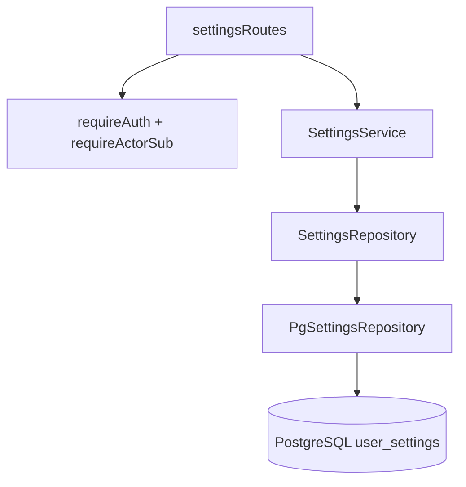
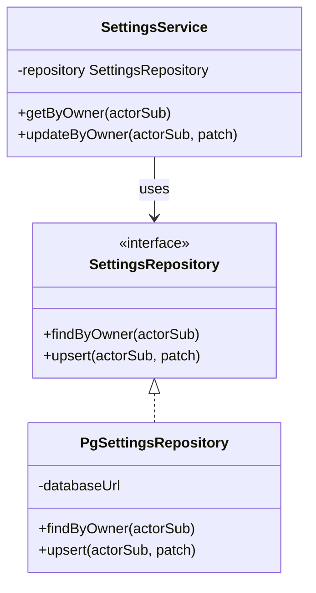

# Input Preferences Module

**Code path:** `backend/src/modules/input-preferences/`

Persists **per-user UI preferences** used by the editor: **`lastUsedLocale`** (string, e.g. `en-US`), **`keyboardVisible`** (boolean), and **`keyboardLayoutOverrides`** (JSON object: per supported document language, **on-screen letter output → physical key label** for remapping). One logical row per **Keycloak subject** (`owner_id`).

## Features

**What it does**
- **`GET /settings`:** returns merged settings for the authenticated user (defaults if no row).
- **`PUT /settings`:** partial update — at least one of `lastUsedLocale`, `keyboardVisible`, or `keyboardLayoutOverrides`.
- Upserts into PostgreSQL on update (`ON CONFLICT (owner_id) DO UPDATE`).
- Validates `keyboardLayoutOverrides` with Zod (`keyboard-layout-overrides-schema.ts`); reads from Postgres are normalized through the same schema where possible (see `parseKeyboardLayoutOverrides` in `pg-settings-repository.ts`).

**What it does not do**
- Define default keyboard layouts or key rows (those live in the frontend `keyboardLayouts.ts` registry).
- Validate locale strings against a fixed enumeration (stored as free-form `text` with Zod `min(2)` on update).
- Store document content or auth tokens.

## Internal architecture

### Design justification (senior review)

- **Separate module from documents** so editor preferences can evolve (new columns) without touching document migrations’ semantics.
- **`SettingsRepository` port** matches the document module pattern: test doubles without PostgreSQL.
- **Defaults in `findByOwner`** when no row exists avoids forcing a write on first `GET` and matches frontend expectations (`en-US`, keyboard visible, empty overrides).

## Data abstractions

| Type | Fields |
|------|--------|
| `UserSettings` | `lastUsedLocale: string`, `keyboardVisible: boolean`, `keyboardLayoutOverrides: KeyboardLayoutOverrides` |
| `UpdateSettingsDto` | optional `lastUsedLocale`, `keyboardVisible`, `keyboardLayoutOverrides` |
| `SettingsRepository` | `findByOwner(actorSub)`, `upsert(actorSub, patch)` |

`KeyboardLayoutOverrides` is defined in `keyboard-layout-overrides-schema.ts`: a **strict** object whose top-level keys are exactly the entries in `SUPPORTED_DOCUMENT_LANGUAGES` (same list as `backend/src/shared/document-languages.ts`); each value is a map of output character → physical key string. The Zod object shape is generated from that array, so new languages do not need a hand-edited key list in the schema file.

## Stable storage mechanism

**PostgreSQL** table **`user_settings`**, one row per `owner_id` (primary key). Durable across restarts.

## Storage schema (PostgreSQL)

| Column | Type | Notes |
|--------|------|--------|
| `owner_id` | `text` | PK; Keycloak `sub` |
| `last_used_locale` | `text` | Not null, default `en-US` |
| `keyboard_visible` | `boolean` | Not null, default `true` |
| `keyboard_layout_overrides` | `jsonb` | Not null, default `{}`; per-language output → physical key maps |
| `updated_at` | `timestamptz` | Not null |

**Migrations:** table created in `backend/migrations/002_create_user_settings.js`; `keyboard_layout_overrides` added in **`backend/migrations/006_add_keyboard_layout_overrides.js`**.

## External HTTP API

| Method | Path | Body | Response |
|--------|------|------|----------|
| `GET` | `/settings` | — | `UserSettings` |
| `PUT` | `/settings` | `UpdateSettingsDto` (Zod; ≥1 field among locale, visibility, overrides) | `UserSettings` |

**Auth:** session or Bearer via `requireAuth` (same as documents).

## Declarations (TypeScript)

### `types.ts` — exported

- `UserSettings`, `UpdateSettingsDto`

### `keyboard-layout-overrides-schema.ts` — exported

- `keyboardLayoutOverridesSchema`, `KeyboardLayoutOverrides`

### `settings-repository.ts` — exported

- `SettingsRepository` interface with `findByOwner`, `upsert`

### `settings-service.ts`

| Symbol | Visibility |
|--------|------------|
| `SettingsService` | **Exported** |
| `repository` | **private** field |
| `getByOwner`, `updateByOwner` | **public** methods |

### `pg-settings-repository.ts`

| Symbol | Visibility |
|--------|------------|
| `PgSettingsRepository` | **Exported** |
| `parseKeyboardLayoutOverrides` | **Exported** (for tests) |
| `databaseUrl` | **private** field |
| `findByOwner`, `upsert` | **public** methods |
| `SettingsRow`, `toSettings` | **Not exported** (file-private) |

### `settings-routes.ts`

| Symbol | Visibility |
|--------|------------|
| `settingsRoutes` | **Exported** |
| `updateSettingsSchema` | **Not exported** |

## Class hierarchy (module-internal)

