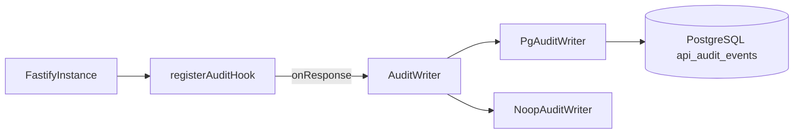
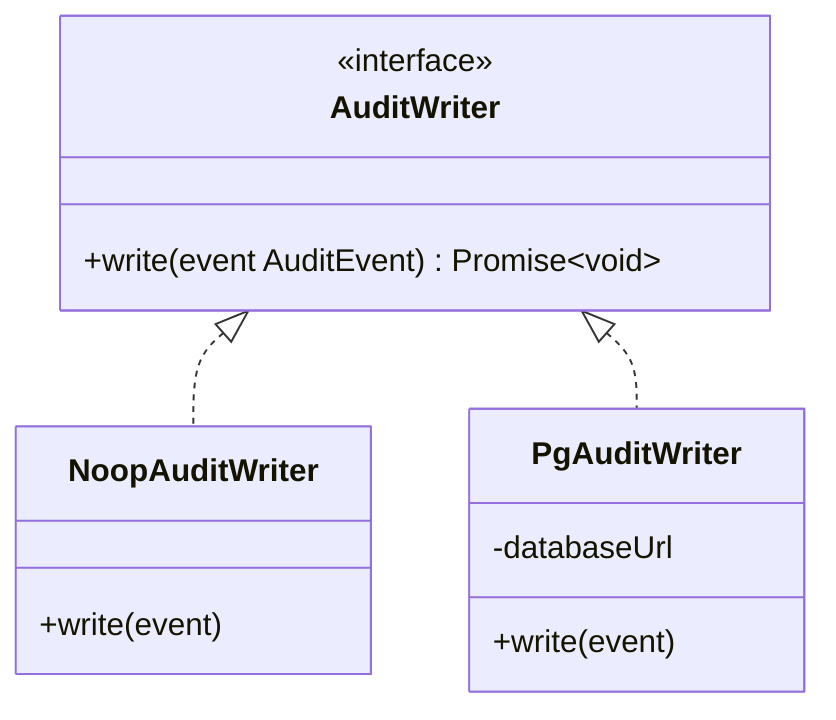

# Operational Store Module

**Code path:** `backend/src/modules/operational-store/`

Append-only **API audit logging** for mutating HTTP methods. Hooks into Fastify **`onResponse`** and persists a row per qualifying request via **`PgAuditWriter`**. Does not implement idempotency keys, rate-limit storage, or business rules.

## Features

**What it does**
- Records **`POST` / `PUT` / `PATCH` / `DELETE`** requests after the response is sent (`onResponse`).
- Stores: Fastify **`request.id`**, optional **`actorSub`** (null if unauthenticated route), **route pattern**, **method**, **status code**, **SHA-256 hash of JSON body** (or null if no body).
- Swallows persistence errors after logging (API behavior is not blocked by audit failures).

**What it does not do**
- Idempotency or deduplication storage (not implemented anywhere in this repo).
- Rate limiting accounting.
- Cryptographic signing of audit rows or tamper-evident chains.
- Query APIs for auditors (no `GET /audit` routes).

## Internal architecture

### Design justification (senior review)

- **`AuditWriter` interface** lets tests use `NoopAuditWriter` and keeps `buildApp` working when `DATABASE_URL` is absent (falls back to noop).
- **`onResponse`** ensures the **status code** recorded matches what the client received (including errors).
- **Payload hash** avoids storing raw PII-heavy bodies while supporting integrity checks for replay debugging.
- **Failure isolation:** audit write errors are logged but do not change HTTP status (availability over strict audit consistency).

## Data abstraction

**`AuditEvent`** (passed to `write`)

| Field | Type | Notes |
|-------|------|--------|
| `requestId` | string | Fastify request id |
| `actorSub` | string \| null | From `request.requestContext.actorSub` |
| `route` | string | `request.routeOptions.url` or `request.url` |
| `method` | string | HTTP method |
| `statusCode` | number | `reply.statusCode` |
| `payloadHash` | string \| null | SHA-256 hex of serialized body, or null |

## Stable storage mechanism

**PostgreSQL** table **`api_audit_events`**. Rows are **insert-only** in code (no updates/deletes), supporting forensic retention policies later.

## Storage schema (PostgreSQL)

From `backend/migrations/003_create_api_audit_events.js`:

| Column | Type | Notes |
|--------|------|--------|
| `id` | `uuid` | PK, default `gen_random_uuid()` |
| `request_id` | `text` | Nullable in DB |
| `actor_sub` | `text` | Nullable |
| `route` | `text` | Not null |
| `method` | `text` | Not null |
| `status_code` | `integer` | Not null |
| `created_at` | `timestamptz` | Not null, default `now()` |
| `payload_hash` | `text` | Nullable |

**Index:** `created_at` (`idx_api_audit_events_created_at`) for time-range pruning.

**Insert SQL** (in `pg-audit-writer.ts`) supplies `request_id` through `payload_hash` and uses `now()` for `created_at`.

## External API for callers

- **HTTP:** none (no routes).
- **Programmatic:** `registerAuditHook(app, auditWriter)` — called once from `buildApp`.

## Declarations (TypeScript)

### `audit-writer.ts` — exported

| Symbol | Visibility |
|--------|------------|
| `AuditEvent` interface | **Exported** |
| `AuditWriter` interface | **Exported** (`write(event)`) |
| `NoopAuditWriter` class | **Exported** |
| `write` on `NoopAuditWriter` | **public** |

### `pg-audit-writer.ts`

| Symbol | Visibility |
|--------|------------|
| `PgAuditWriter` class | **Exported** |
| `databaseUrl` | **private** field |
| `write` | **public** method |

### `audit-hook.ts`

| Symbol | Visibility |
|--------|------------|
| `registerAuditHook` | **Exported** |
| `shouldAuditMethod` | **Not exported** (file-private) |
| `hashRequestBody` | **Not exported** (file-private) |

## Class hierarchy (module-internal)

