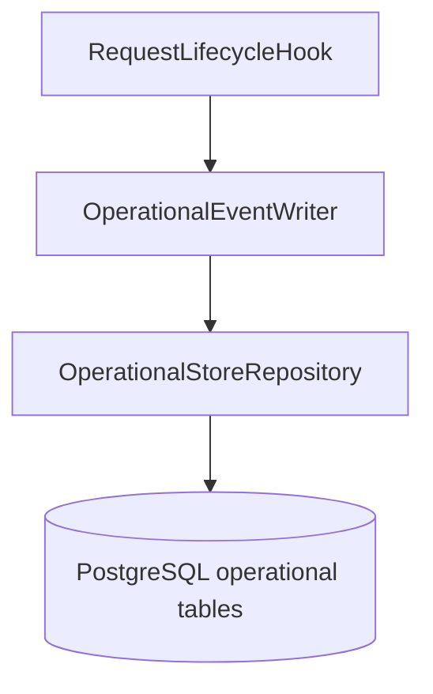
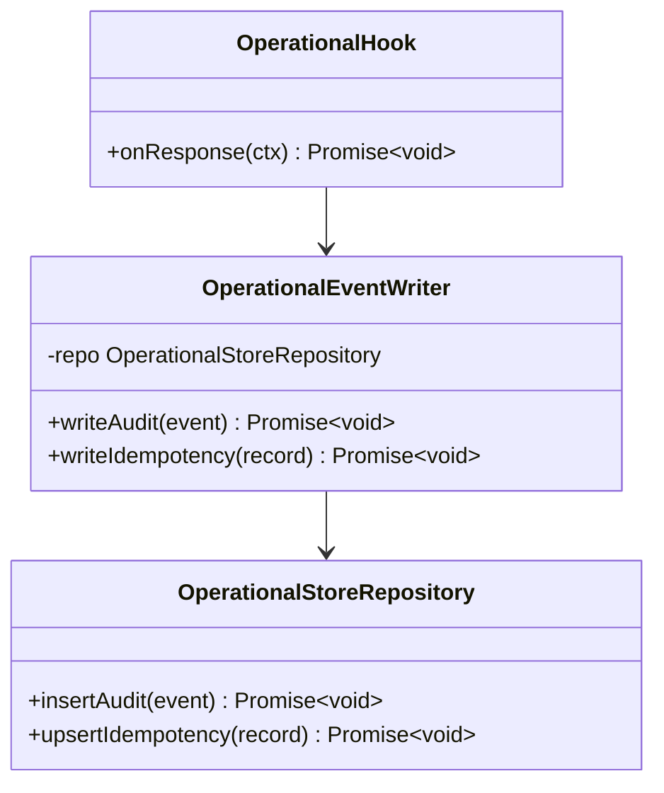

# Operational Store Module

## Features
**Can do**
- Persist immutable audit events for mutating API requests.
- Provide a durable trail for debugging and incident analysis.
- Support optional idempotency storage when specific endpoints require replay protection.

**Does not do**
- Domain business logic (documents/settings).
- Authentication or authorization decisions.
- Primary rate limiting decisions (prefer edge/gateway controls).

## Internal Architecture

### Design Justification
- Keeps operational concerns separate from product domain modules.
- Durable audit logging improves post-incident forensics.
- Idempotency remains optional and endpoint-driven to avoid over-engineering.

## Data Abstractions
- `AuditEvent`
  - `id`, `requestId`, `actorSub`, `route`, `method`, `statusCode`, `payloadHash`, `createdAt`
- `IdempotencyRecord` (optional)
  - `key`, `actorSub`, `route`, `responseCode`, `responseBody`, `expiresAt`

## Stable Storage Mechanism
- PostgreSQL operational tables.

## Storage Schemas
- Required:
  - `api_audit_events(id uuid pk, request_id text, actor_sub text, route text, method text, status_code int, created_at timestamptz, payload_hash text)`
- Optional (only when idempotent endpoints are introduced):
  - `api_idempotency_keys(key text pk, actor_sub text, route text, response_code int, response_body jsonb, expires_at timestamptz)`

## External REST API
- None. This module is internal-only.

## Classes, Methods, Fields
- **Public** `OperationalEventWriter`
  - `public writeAudit(event: AuditEvent): Promise<void>`
  - `public writeIdempotency(record: IdempotencyRecord): Promise<void>`
  - `private repo: OperationalStoreRepository`
- **Public** `OperationalStoreRepository`
  - `public insertAudit(event: AuditEvent): Promise<void>`
  - `public upsertIdempotency(record: IdempotencyRecord): Promise<void>`
- **Private** `OperationalHook`
  - `public onResponse(ctx: RequestContext): Promise<void>`

## Class Hierarchy Diagram

