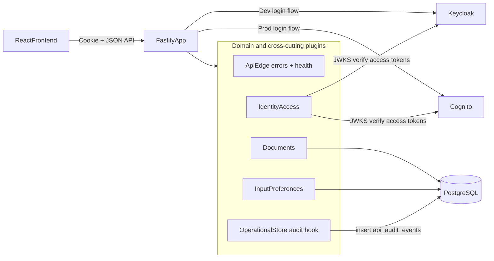

# GlossaDocs Backend System Architecture

This is the system-level architecture for the single backend that supports:

- Story 1: basic editor with durable document save
- Story 3: Russian on-screen keyboard with persisted user preference

**Module-level detail:** each bounded area has a dedicated page under [Module Architecture](backend-architecture.md#module-architecture) (`docs/architecture/modules/`).

## Design Goals

- One backend system, no story-specific backend silos.
- Standards-based authentication (OIDC; local Keycloak and production Cognito support); the app does not store passwords.
- Durable storage for documents, settings, and audit events; session tokens stored server-side (memory or Redis) when using cookie sessions.
- Local-first development with minimal AWS architecture drift.

## Unified System Description

GlossaDocs uses a **modular monolith** in Fastify (`backend/src/app.ts` composes plugins). Incoming requests pass through **CORS**, **cookies**, and a **global error handler** ([API Edge Module](modules/api-edge-module.md)), then **route plugins** for identity, documents, settings, and **response-time audit hooks** ([Operational Store Module](modules/operational-store-module.md)).

**Authentication:** the API accepts either an **httpOnly session cookie** (opaque id → access token in `AuthSessionStore`) or **`Authorization: Bearer`** with the same JWT verifier ([Identity and Access Module](modules/identity-access-module.md)). Protected routes resolve `actorSub` from the verified token and enforce **ownership** in SQL (`owner_id = actorSub`) for documents and settings.

Naming conventions:

- OIDC claim / external identity field: `sub`
- Internal runtime identity variable: `actorSub`
- Domain storage owner key: `owner_id`

Key architectural separations:

- **Identity and access:** JWT verification, session-backed login/logout, provider-adapter flows for register / password reset
- **Documents:** user-owned document CRUD, folders, sanitization, optional encryption at rest, and per-document language-aware font metadata
- **Input preferences:** per-user settings (`keyboardVisible`, `lastUsedLocale`)
- **API edge:** centralized error mapping and health/readiness endpoints (no domain logic)
- **Operational store:** append-only HTTP audit trail in PostgreSQL (no idempotency store in this codebase)

## Unified Mermaid Diagram

### Design Justification (Senior Review)

- **Security boundary:** credential verification stays in the configured IdP (Keycloak/Cognito); GlossaDocs verifies **signed** JWTs and never persists user passwords.
- **Modular monolith:** avoids distributed-system overhead while keeping replaceable ports (`DocumentRepository`, `SettingsRepository`, `AuditWriter`).
- **Extensibility:** Story 3 adds settings without changing document or auth contracts.
- **Cloud portability:** same module boundaries for Docker Compose, ECS, or Lambda (see [AWS deployment runbook](../deployment/aws-amplify-apigw-lambda-auth-runbook.md) and the developer index in the root [README.md](../../README.md)).

## Cross-Module REST API Surface

| Area | Endpoints |
|------|-----------|
| Health | `GET /health`, `GET /ready` |
| Public auth metadata | `GET /auth/public` (optional; OIDC URLs for alternate clients) |
| Session auth | `POST /auth/login`, `POST /auth/logout`, `GET /auth/session` |
| Account | `POST /auth/register`, `POST /auth/password-reset` |
| Authenticated | `GET /me`, `GET/POST/PUT/DELETE /documents`, `GET/POST/PUT/DELETE /folders`, `GET/PUT /settings` |

**Auth model:** `GET /health` and `GET /ready` are unauthenticated. **`POST /auth/login`**, **`POST /auth/register`**, **`POST /auth/password-reset`**, and **`GET /auth/public`** do not require a prior session (logout clears cookie without Bearer). **`GET /auth/session`** requires a valid session cookie. All other routes in the table above use **`requireAuth`**: session cookie **or** `Authorization: Bearer` with a valid access token.

## Security Baseline

- JWT verification: signature (JWKS), issuer, audience, expiry (`JoseTokenVerifier`).
- Registration and password reset are delegated to the configured IdP adapter. Local Docker defaults still use Keycloak; production mode targets Cognito.
- Ownership enforced in repositories: `owner_id = actorSub` for documents and settings.
- Request bodies validated with **Zod** on mutating routes.
- HTML sanitization on document write path (see [Document Module](modules/document-module.md)).
- Mutating requests logged to **`api_audit_events`** (see [Operational Store Module](modules/operational-store-module.md)).

**Not implemented in this backend:** application-level rate limiting, idempotency key storage, or request body size overrides beyond Fastify defaults.

## Capacity Baseline

- 1 Fastify instance (example: 0.5 vCPU, 1 GB RAM)
- 1 PostgreSQL instance with connection pooling (`backend/src/shared/db.ts`)
- Local Keycloak single node for low traffic dev environments

This comfortably supports small-team CRUD + settings workloads; tune pools and instances for production SLAs.

## React application shell (frontend)

The SPA is not a second backend, but a few behaviors are worth documenting so refactors do not reintroduce redundant work:

- **Document list stays mounted** when the editor is open (`src/app/App.tsx`). The list is **hidden** (and **inert** when the editor is active) so returning from the editor does not remount the whole tree. A version counter (`listSyncRequestVersion`) triggers a **quiet refresh** of folders and documents when the user leaves the editor so the list reflects saves without a full-page loading state.
- **Opening a document from the list** passes the list row’s `Document` as `initialDocument` into `Editor`, so the editor can **skip a duplicate `getDocument` call** when the list payload already included the body.
- **Guest logout** does not call `POST /auth/logout` because there is no server session; only `clearClientAuthState` runs (`src/app/utils/auth.ts`).

## Deployment Mapping

- **Local:** Docker Compose with API + PostgreSQL + Keycloak (+ optional Redis for sessions)
- **AWS auth target:** API Gateway + Lambda + Cognito + RDS PostgreSQL direct TLS (+ Redis for sessions), plus VPC CodeBuild migrations before release

## Runtime Configuration

Variables consumed via `getConfig` / `buildApp` in this repo (see `backend/src/shared/config.ts` and `backend/src/app.ts`):

| Variable | Purpose |
|----------|---------|
| `NODE_ENV` | `development` \| `test` \| `production` |
| `APP_ENV` | `dev` \| `prod`; top-level runtime mode switch |
| `AUTH_PROVIDER` | `keycloak` \| `cognito`; selects auth adapter |
| `API_PORT` | Listen port |
| `CORS_ALLOWED_ORIGINS` | Comma-separated origins or `*` (wildcard rejected in production with credentials) |
| `API_BODY_LIMIT_BYTES` | Max JSON payload size for document saves (default 15 MiB) |
| `DATABASE_URL` | PostgreSQL connection string |
| `OIDC_ISSUER_URL`, `OIDC_AUDIENCE`, `OIDC_JWKS_URL` | JWT verification for `JoseTokenVerifier` |
| `OIDC_PUBLIC_ISSUER_URL`, `OIDC_PUBLIC_CLIENT_ID`, `OIDC_PUBLIC_REDIRECT_URI` | Optional; `GET /auth/public` |
| `KEYCLOAK_ADMIN_URL`, `KEYCLOAK_REALM`, `KEYCLOAK_ADMIN_USERNAME`, `KEYCLOAK_ADMIN_PASSWORD` | Keycloak Admin API (register / reset) |
| `KEYCLOAK_TOKEN_URL`, `KEYCLOAK_CLIENT_ID`, `KEYCLOAK_CLIENT_SECRET` | Resource-owner password grant for `POST /auth/login` |
| `COGNITO_REGION`, `COGNITO_USER_POOL_ID`, `COGNITO_CLIENT_ID`, `COGNITO_CLIENT_SECRET` | Cognito auth adapter config |
| `COGNITO_PUBLIC_DOMAIN` | Cognito Hosted UI domain used by `GET /auth/public` |
| `AUTH_SESSION_COOKIE_NAME`, `AUTH_SESSION_TTL_SECONDS`, `AUTH_SESSION_SECURE_COOKIE` | Session cookie |
| `AUTH_SESSION_STORE`, `REDIS_URL`, `AUTH_REDIS_KEY_PREFIX`, `AUTH_SESSION_ENCRYPTION_KEY` (required in prod with Redis) | `memory` (dev) or `redis` (production sessions) |
| `DOCUMENT_ENCRYPTION_KEY` | Optional AES-GCM for document title/content at rest |

For AWS deployment/auth wiring and next-branch completion steps, see [deployment runbook](../deployment/aws-amplify-apigw-lambda-auth-runbook.md).
