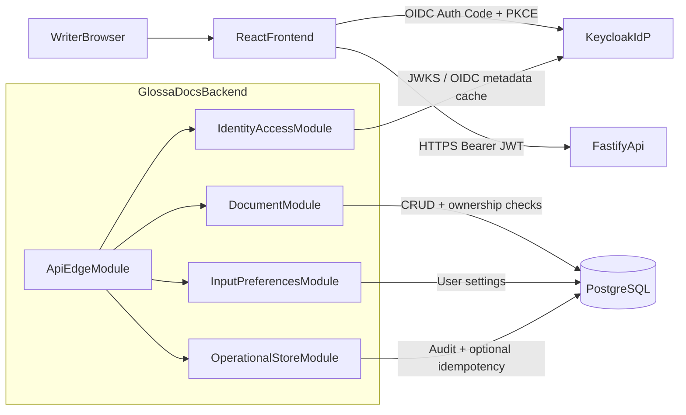

# GlossaDocs Backend System Architecture

This is the system-level architecture for the single backend that supports:
- Story 1: basic editor with durable document save
- Story 3: Russian on-screen keyboard with persisted user preference

## Design Goals
- One backend system, no story-specific backend silos.
- Standards-based authentication (OIDC/Keycloak), no custom password handling.
- Durable storage for all required features.
- Local-first development flow with minimal AWS architecture drift.

## Unified System Description
GlossaDocs uses a modular monolith in Fastify. The API edge receives all web traffic, validates requests, authenticates via JWT, and routes to domain modules. Domain modules persist state in PostgreSQL and enforce authorization invariants (especially ownership for documents).

Naming conventions:
- OIDC claim / external identity field: `sub`
- Internal runtime identity variable: `actorSub`
- Domain storage owner key: `owner_id`

Key architectural separations:
- **Identity and access**: token verification and principal extraction
- **Documents**: user-owned document CRUD
- **Input preferences**: user settings like `keyboardVisible` and `lastUsedLocale`
- **API edge/platform**: validation, rate limiting, error mapping, health

## Unified Mermaid Diagram

## Design Justification (Senior Review)
- **Security boundary correctness**: credential verification remains in Keycloak; app verifies signed tokens only.
- **Operational pragmatism**: a modular monolith avoids early distributed-system complexity while preserving strong boundaries.
- **Extensibility**: Story 3 extends settings without changing document APIs or auth model.
- **Cloud portability**: unchanged boundaries across local Docker and AWS ECS/RDS.

## Cross-Module REST API Surface
- `GET /health`
- `GET /ready`
- `GET /me`
- `GET /documents`
- `GET /documents/:id`
- `POST /documents`
- `PUT /documents/:id`
- `DELETE /documents/:id`
- `GET /settings`
- `PUT /settings`

All endpoints except `/health` and `/ready` require a valid Bearer JWT.

## Security Baseline
- Strict JWT verification: signature, issuer, audience, expiry.
- Ownership checks in repository predicates (`owner_id = actorSub`).
- Input schema validation and payload limits.
- HTML sanitization on document write path.
- Audit logs for mutating operations.

## Capacity Baseline
- 1 Fastify instance (0.5 vCPU, 1 GB RAM)
- 1 PostgreSQL instance with pooling
- Keycloak single node for low traffic

This comfortably supports 10 concurrent users for CRUD + settings operations.

## Deployment Mapping
- **Local**: Docker Compose with API + PostgreSQL + Keycloak
- **AWS target**: API on ECS/EC2, PostgreSQL on RDS, Keycloak on ECS/EC2, CloudFront + ALB edge

## Runtime Configuration
- `API_PORT`
- `DATABASE_URL`
- `OIDC_ISSUER_URL`
- `OIDC_AUDIENCE`
- `OIDC_JWKS_URL`
- `CORS_ALLOWED_ORIGINS`
- `RATE_LIMIT_WINDOW_MS`
- `RATE_LIMIT_MAX_REQUESTS`
- `NODE_ENV`

