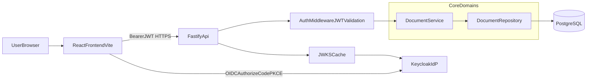
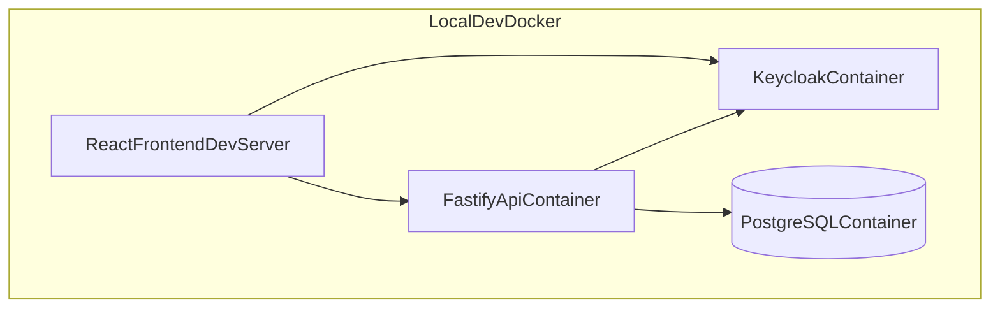
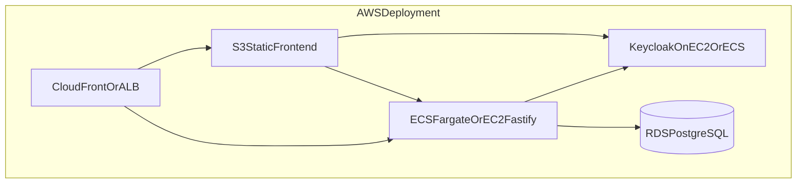
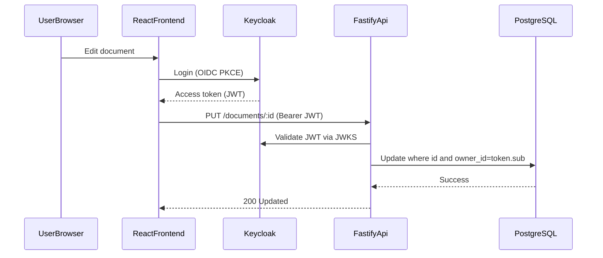

# GlossaDocs Backend Architecture

This document defines the backend architecture for GlossaDocs V1, including local development, AWS deployment targets, security boundaries, and implementation phases.

## Goals

- Replace browser-only IndexedDB document storage with server persistence.
- Provide secure username/email + password login without building custom auth logic.
- Support local development now and AWS deployment later.
- Handle at least 10 simultaneous users with comfortable headroom.

## Technology Decisions (V1)

- **Frontend**: React + Vite (existing)
- **Backend API**: Node.js + TypeScript + Fastify
- **Identity Provider**: Keycloak (self-hosted OIDC provider)
- **Database**: PostgreSQL
- **Auth Protocol**: OAuth 2.1 / OIDC Authorization Code + PKCE

## Logical System Architecture

## Deployment Architecture

### Local Development

### AWS Target

## Request Flow: Save Document

## Component Responsibilities

- **ReactFrontendVite**
  - Handles login redirect flow and receives OIDC tokens.
  - Calls backend document APIs with JWT access token.
  - Maintains UI state and autosave behavior.

- **KeycloakIdP**
  - Stores and verifies user credentials.
  - Issues signed JWT access tokens.
  - Exposes JWKS metadata for backend signature verification.

- **FastifyApi**
  - Serves protected document CRUD endpoints.
  - Verifies token signature, issuer, audience, expiration, and claims.
  - Enforces owner-based access control for every document query.

- **PostgreSQL**
  - Persistent storage for all documents.
  - Supports indexed, per-user document access patterns.

## Data Model (V1)

### documents

- `id` UUID primary key
- `owner_id` text (OIDC `sub` claim), indexed
- `title` text
- `content` text (HTML payload from editor)
- `language` text check constraint (`en`, `de`, `ru`)
- `created_at` timestamp with time zone
- `updated_at` timestamp with time zone

## API Contract (V1)

- `GET /health` - service liveness/readiness
- `GET /me` - returns authenticated user identity from JWT claims
- `GET /documents` - list current user documents (sorted by `updated_at desc`)
- `GET /documents/:id` - fetch a single owned document
- `POST /documents` - create document for authenticated user
- `PUT /documents/:id` - update owned document
- `DELETE /documents/:id` - delete owned document

All `/documents*` and `/me` endpoints require valid JWT access token.

## Security Requirements

- Validate JWT with cached JWKS lookup and strict issuer/audience checks.
- Use HTTPS in production for frontend, backend, and IdP traffic.
- Enforce authorization in the data access layer (`owner_id = token.sub`).
- Apply request schema validation and payload limits.
- Add rate limiting to auth-sensitive and write endpoints.
- Keep database and Keycloak in private networking scope in AWS.

## Capacity and Performance (10 Concurrent Users)

The V1 architecture easily supports 10 simultaneous users for standard document CRUD workloads.

Recommended baseline:

- 1 Fastify instance (0.25 to 0.5 vCPU, 512 MB to 1 GB memory)
- PostgreSQL with connection pooling
- JWT verification with JWKS caching
- Indexes:
  - `documents(owner_id, updated_at desc)`
  - `documents(id, owner_id)`

Scale path:

- Horizontal scale API instances behind ALB.
- Move Keycloak and Postgres to larger instances only when needed.

## Environment Configuration

Use environment variables for all environment-specific values:

- `API_PORT`
- `DATABASE_URL`
- `OIDC_ISSUER_URL`
- `OIDC_AUDIENCE`
- `OIDC_JWKS_URL` (optional if discoverable from issuer metadata)
- `CORS_ALLOWED_ORIGINS`
- `NODE_ENV`

## Implementation Phases

1. **Scaffold Backend**
   - Create `backend/` Fastify TypeScript service.
   - Add Docker Compose for Postgres + Keycloak + API.
   - Add `GET /health`.

2. **Integrate Auth**
   - Add JWT verification plugin/middleware.
   - Add protected `GET /me`.

3. **Add Document Persistence**
   - Add DB migrations for `documents`.
   - Implement repository, service, and CRUD routes with ownership checks.

4. **Migrate Frontend**
   - Replace IndexedDB operations with API client calls.
   - Replace placeholder auth utilities with OIDC flow.

5. **Harden and Prepare AWS**
   - Add input validation, rate limiting, and structured logging.
   - Add deployment config and runbook for AWS target.

## Definition of Done (V1)

- Users can register/login through Keycloak (username/email + password).
- Users can create/read/update/delete only their own documents.
- No document data is persisted in IndexedDB except optional offline cache.
- Full local startup is documented and reproducible.
- Deployment variables are fully environment-driven for AWS portability.
