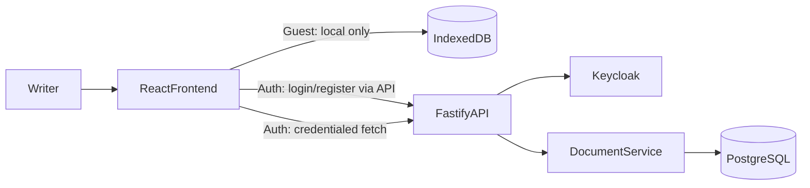

# User Story 1 Spec: Basic Editor with Persistent Save

## Header
- **Story**: As a writer, I want a basic document editor where I can create, edit, and save a text document so that I can actually write and return to my work.
- **Status**: **Implemented** for signed-in users (documents and settings via the Fastify API and PostgreSQL). **Guest mode** remains a local-first path using IndexedDB and does not call the documents API.
- **Depends on**: [`docs/architecture/backend-architecture.md`](../architecture/backend-architecture.md)
- **Single-backend assumption**: This story uses the same Fastify + Keycloak + PostgreSQL backend as the rest of the app.

## Goal
Provide reliable document persistence and ownership for authenticated users while keeping the existing editor UX (manual save + autosave, document list, open/delete, rich-text formatting, import/export). Guests can still use the app without any backend.

## Runtime modes (current behavior)

| Mode | Documents | Typical use |
|------|-----------|-------------|
| **Guest** | `src/app/utils/db.ts` (IndexedDB) | `npm run dev:guest`, or “Continue as Guest” |
| **Authenticated** | `documentsApi` → `GET/POST/PUT/DELETE /documents` | Docker or full-stack dev with Keycloak |

The split is implemented in **`src/app/data/document-repository.ts`**, which mirrors a single API for both modes (`getDocument`, `saveDocument`, `getAllDocuments`, `deleteDocument`).

## Current code baseline
- **Storage abstraction**: `src/app/data/document-repository.ts` (guest → IndexedDB, authenticated → HTTP API with cookies).
- **IndexedDB implementation**: `src/app/utils/db.ts` (guest only).
- **Editor load/save, dirty state, autosave**: `src/app/components/Editor.tsx` uses `document-repository` and `src/app/hooks/useAutoSave.ts`.
- **Document list / delete**: `src/app/components/DocumentList.tsx` uses the same repository layer.
- **HTTP client**: `src/app/api/client.ts` sends requests with `credentials: "include"` (session cookie), not a bearer token in `localStorage`.

## Architecture (Story 1)

### Information flow (authenticated)
1. User signs in through app-hosted screens; backend exchanges credentials with Keycloak and establishes a session (**httpOnly cookie**).
2. The frontend calls protected routes with **cookie credentials** (see `apiRequest` in `src/app/api/client.ts`). The browser does not store passwords or access tokens for document calls.
3. The API resolves the actor from the session, scopes documents by `owner_id`, and performs CRUD.
4. `document-repository` uses create vs update based on document id and server state (including recovery if a stale id returns 404).

### Autosave
- **Delay**: `AUTO_SAVE_DELAY_MS` in `src/app/utils/constants.ts` is **10 seconds** after the document becomes dirty (timer resets while editing).
- **Manual save**: Toolbar save and **Ctrl/Cmd+S** trigger the same save path; an in-flight guard avoids overlapping saves (`Editor.tsx`).

## Functional requirements (as implemented)
- Create a new document with a default title (and default language from settings when available).
- Edit title and rich-text content; manual save and autosave when dirty.
- List, open, and delete documents (guest: local only; authenticated: server).
- Update document language with the editor language selector; persisted on save.
- Save preserves latest title, content, and language together on the server path.

## Backend API contract
All routes require an authenticated session unless using guest mode locally.

- `GET /documents` → list current user’s documents (ordered by `updated_at` descending).
- `GET /documents/:id` → fetch one owned document (`404` if missing or not owned).
- `POST /documents` → create (`201`).
- `PUT /documents/:id` → partial update (`title`, `content`, `language` — at least one field).
- `DELETE /documents/:id` → delete (`204`).
- `GET /me` → profile/bootstrap for the authenticated user (used alongside session bootstrap in the app).

## Data schema (backend)
Table `documents`:
- `id` uuid PK
- `owner_id` text not null (Keycloak subject)
- `title` text not null
- `content` text not null (HTML; sanitized on write in the API)
- `language` text not null, constrained to supported codes (see `backend/src/shared/document-languages.ts` and migrations)
- `created_at`, `updated_at` timestamptz not null

Indexes include `(owner_id, updated_at desc)` for listing.

Optional: when `DOCUMENT_ENCRYPTION_KEY` is set, title/content may be encrypted at rest in PostgreSQL (see `README.md` and `docs/architecture/document-encryption.md`).

## Frontend integration (implemented)
- **`document-repository.ts`** implements the dual-mode strategy and remote create/update selection.
- **`Editor.tsx`** and **`DocumentList.tsx`** consume that layer only (not `db.ts` directly for feature logic).
- **Auth UX** is documented in the root `README.md` (login, register, password reset, guest mode).

## Non-goals (Story 1)
- Collaboration / realtime editing
- Version history
- Offline sync and conflict resolution across devices
- Automatic migration of guest IndexedDB data into a new account (not implemented; remains a possible future enhancement)

## Acceptance criteria
- **Authenticated**: User can create, edit, save, reopen, and delete documents across refresh; data lives in PostgreSQL via the API; IndexedDB is not required for normal operation.
- **Guest**: Same editor UX with persistence in IndexedDB only.
- **Authorization**: User cannot access another user’s document IDs (API returns `404` / error as implemented).
- **Autosave**: Timer runs only while `hasUnsavedChanges` is true; idle document does not autosave repeatedly.

## Risks and mitigations
- **Save race between autosave and manual save**: Mitigated with a client-side in-flight guard and queued re-run if save was requested while busy (`Editor.tsx`).
- **Unsafe HTML from `contentEditable`**: Mitigated by backend sanitization on write (see `README.md` and backend sanitizer tests).
- **Stale local id after server changes**: Mitigated by recreate-on-404 behavior in `document-repository.ts` for authenticated saves.

## Test plan
- **Backend**: `backend/test/document-routes.test.ts`, `backend/test/document-service.test.ts`, `backend/test/me-routes.test.ts`, `backend/test/document-sanitizer.test.ts` (and encryption tests if applicable).
- **Frontend**: `src/test/document-repository.test.ts` (authenticated persistence behavior with mocked API).
