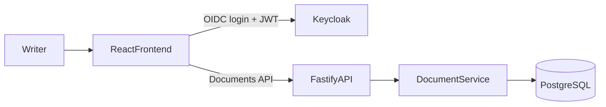

# User Story 1 Spec: Basic Editor with Persistent Save

## Header
- **Story**: As a writer, I want a basic document editor where I can create, edit, and save a text document so that I can actually write and return to my work.
- **Status**: Draft for implementation
- **Depends on**: `docs/backend-architecture.md`
- **Single-backend assumption**: This story uses the same Fastify + Keycloak + PostgreSQL backend used by all stories.

## Goal
Replace browser-only IndexedDB persistence with backend-backed CRUD while keeping the current editor UX (manual save + autosave, document list, open/delete, formatting).

## Current Code Baseline
- Local document persistence is currently in `src/app/utils/db.ts`.
- Editor load/save and dirty state are in `src/app/components/Editor.tsx`.
- Document list/open/delete is in `src/app/components/DocumentList.tsx`.

## Architecture (Story 1)

### Information Flow
1. User logs in through OIDC.
2. Frontend sends JWT with all document requests.
3. API authorizes by token subject and performs document CRUD.
4. Frontend replaces IndexedDB calls with API calls.

## Functional Requirements
- User can create new document with default title.
- User can edit title/content and save manually.
- Autosave runs only when document is dirty.
- User can reopen prior documents from list.
- User can delete own documents.
- Save behavior must preserve latest title/content together.

## Backend API Contract
- `GET /documents` -> list current user's docs by `updated_at desc`
- `GET /documents/:id` -> get one owned doc
- `POST /documents` -> create owned doc
- `PUT /documents/:id` -> update title/content/language
- `DELETE /documents/:id` -> delete owned doc
- `GET /me` -> token sanity/profile bootstrap for frontend

## Data Schema (Backend)
Table `documents`:
- `id` uuid pk
- `owner_id` text not null (OIDC `sub`)
- `title` text not null
- `content` text not null
- `language` text not null check in (`en`,`de`,`ru`)
- `created_at` timestamptz not null
- `updated_at` timestamptz not null

Indexes:
- `(owner_id, updated_at desc)`
- `(id, owner_id)`

## Frontend Integration Plan
- Replace `src/app/utils/db.ts` storage methods with API client wrappers (same function surface preferred to reduce churn).
- Update `Editor.tsx` load/save lifecycle to call API wrappers.
- Update `DocumentList.tsx` list/delete/import-save to call API wrappers.
- Keep existing UI behaviors (`hasUnsavedChanges`, save status, toasts).

## Non-Goals (Story 1)
- Collaboration/realtime editing
- Version history
- Offline sync conflict resolution

## Acceptance Criteria
- Logged-in user can create/edit/save/reopen/delete documents across browser refresh.
- Data is no longer required from IndexedDB for normal operation.
- User cannot access another user's document IDs.
- Autosave does not trigger when there are no unsaved changes.

## Risks and Mitigations
- **Risk**: Save race between autosave and manual save.
  - **Mitigation**: Client-side in-flight guard and last-write-wins by `updated_at`.
- **Risk**: HTML content from `contentEditable` can include unsafe markup.
  - **Mitigation**: sanitize/allowlist on API write path.
- **Risk**: Migration from local data to backend loses drafts.
  - **Mitigation**: optional one-time import flow from local IndexedDB.

## Test Plan
- API integration tests: CRUD with ownership enforcement.
- Frontend smoke flow: create -> type -> autosave -> refresh -> reopen.
- Negative tests: forbidden access to another user's doc.

