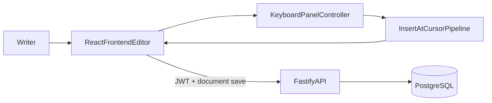

# User Story 3 Spec: Integrated Russian On-Screen Keyboard

## Header
- **Story**: As a multilingual writer, I want an integrated on-screen keyboard for a non-Latin alphabet so that I can type special characters directly inside the editor.
- **V1 scope**: Russian keyboard only (Cyrillic), phonetic mapping.
- **Status**: Draft for implementation
- **Depends on**:
  - `docs/backend-architecture.md`
  - `docs/specs/user-story-1-basic-editor-spec.md`
- **Single-backend assumption**: Uses the same auth/session/document backend as Story 1. No separate service.

## Goal
Add an in-editor Russian keyboard panel that inserts characters at cursor, supports uppercase/punctuation, and persists visibility preference globally.

## Current Code Baseline
- Keyboard UI and insertion pipeline already exist in `src/app/components/Editor.tsx` and `LanguageKeyboard` integration.
- Keyboard remapping utilities exist (`getRemappedCharacter` import in `Editor.tsx`), but persistence and backend-aware preference model are not finalized.

## Architecture (Story 3)

### Information Flow
1. User toggles keyboard panel (default visible).
2. User clicks key or long-press variant.
3. Character is inserted via same editor insertion path used for typed text.
4. Document save/autosave persists content through Story 1 backend.
5. Keyboard visibility preference is persisted as a global user setting (backend-backed when settings endpoint is available; local fallback during transition).

## Functional Requirements
- Keyboard panel is visible by default.
- User can show/hide via button (and optional hotkey later).
- Russian layout supports:
  - lowercase + uppercase (shift/caps behavior)
  - punctuation keys needed for practical writing
  - long-press variants for mapped characters
- Key click inserts at caret and replaces selection when selection exists.
- Insertions participate in normal undo/redo behavior.
- Feature is scoped to Russian in V1; extensible to additional layouts later.

## Shared Backend Contract Impact
This story relies on Story 1 document save APIs and adds one cross-story setting:
- `keyboard_visible` (boolean) in user/app settings model.

Recommended settings API (same backend, optional in same phase):
- `GET /settings`
- `PUT /settings` (partial update)

If settings API is deferred, frontend may temporarily store `keyboard_visible` locally but must migrate to backend setting key later.

## Data Model Additions
- In settings storage domain (same backend service):
  - `keyboard_visible boolean default true`

No new document table columns required for Story 3 itself.

## UI/Behavior Contract
- Keyboard is rendered inside editor screen, not separate modal/window.
- Insert pipeline should call a single text insertion utility to avoid divergent behavior between physical keyboard remap and panel input.
- Long-press interaction:
  - short click -> primary mapped character
  - hold -> variant picker -> selected variant insert

## Extensibility Rules
- Layout registry keyed by layout ID (for example `ru-phonetic-v1`), not hard-coded to one locale string.
- Locale choice and layout choice should be decoupled in future (same language may have multiple layouts).
- Avoid embedding key maps directly in component render logic; keep them in data/config modules.

## Acceptance Criteria
- Russian keyboard appears by default in editor.
- User can toggle visibility and preference persists across sessions.
- Clicking keys inserts correct Cyrillic characters at cursor.
- Shift/caps and punctuation behave as defined.
- Long-press variant selection works and inserts chosen character.
- Saving and reopening document retains inserted content via backend persistence.

## Risks and Mitigations
- **Risk**: Insertion path divergence causes formatting/cursor bugs.
  - **Mitigation**: one insertion utility shared by keyboard click and key remap.
- **Risk**: Hard-coded layout blocks future language growth.
  - **Mitigation**: layout registry + config-driven key definitions.
- **Risk**: UX friction on desktop for long-press discoverability.
  - **Mitigation**: tooltip/hint on first use and fallback direct key mapping.

## Test Plan
- Unit tests for Russian mapping tables and long-press variant resolution.
- Component tests for toggle + insertion + shift/caps states.
- End-to-end: login -> open doc -> insert Cyrillic -> save -> refresh -> verify persistence.

