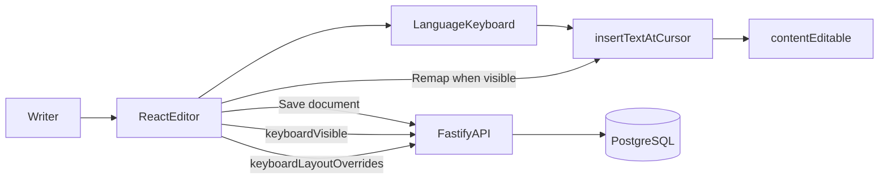

# User Story 3 Spec: Integrated Russian On-Screen Keyboard

## Header
- **Story**: As a multilingual writer, I want an integrated on-screen keyboard for a non-Latin alphabet so that I can type special characters directly inside the editor.
- **V1 product focus**: Russian Cyrillic using a **Latin-key phonetic mapping** (type Latin letters; get Cyrillic output). The same UI component also shows **Latin layouts** (English, German, Spanish, and other supported Latin-script languages) when those document languages are selected.
- **Status**: **Core behavior implemented** in the editor (panel, per-language layouts, physical-key remapping when the keyboard is enabled, visibility toggle + persistence, **user-customizable per-key mappings** with reset to defaults, persisted in user settings). Chinese pinyin input is handled as a separate composition-style panel rather than a fixed key-remap layout, but it is only a starter learner dictionary and not a complete Mandarin IME. **Not implemented**: long-press variant picker; dedicated layout IDs (e.g. `ru-phonetic-v1`) separate from the `Language` enum.
- **Depends on**:
  - [`docs/architecture/backend-architecture.md`](../architecture/backend-architecture.md)
  - [`user-story-1-basic-editor-spec.md`](user-story-1-basic-editor-spec.md) (document save path and dual guest/auth persistence)
- **Single-backend assumption**: Same app and backend as Story 1; no separate keyboard service.

## Goal
Ship an in-editor on-screen keyboard that inserts text at the caret, aligns with the document’s selected language, and keeps keyboard visibility in user settings. Russian and Ukrainian are the primary non–Latin script targets; other entries in `LANGUAGE_KEYBOARD_LAYOUTS` cover the remaining supported document languages.

## Current code baseline
- **Layouts and remapping**: `src/app/utils/keyboardLayouts.ts` — per-`Language` registry in `LANGUAGE_KEYBOARD_LAYOUTS`, `getDefaultKeyboardLayout`, `getKeyboardLayout(language, overrides?)`, `getRemappedCharacter`, merge/diff helpers for user overrides.
- **Panel UI**: `src/app/components/LanguageKeyboard.tsx` — customize mappings (dialog), toggle, rows of keys with primary output + “type with” hint, space bar.
- **Customize dialog**: `src/app/components/KeyboardMappingDialog.tsx` — fixed alphabet letters; user assigns **physical key** per letter (output → `typedWith`); **Reset** confirms before clearing; save via settings.
- **Editor wiring**: `src/app/components/Editor.tsx` — `insertTextAtCursor` (uses `document.execCommand('insertText', …)` when available), `LanguageKeyboard` in a side column, `handleKeyDown` remapping when `isKeyboardVisible` using **effective** layout (defaults + overrides), global **Ctrl/Cmd+D** to toggle visibility (see `src/app/utils/keyboardShortcuts.ts`).
- **Settings**: `keyboardVisible`, `keyboardLayoutOverrides` via `src/app/data/settings-repository.ts` — **authenticated**: `GET/PUT /settings`; **guest**: `localStorage` key `glossadocs_guest_settings`.
- **Backend**: `keyboard_visible`, `last_used_locale`, `keyboard_layout_overrides` (JSONB) on `user_settings`; `PUT /settings` partial update (`backend/src/modules/input-preferences/settings-routes.ts`, migration `006_add_keyboard_layout_overrides.js`).

## Architecture (Story 3)

### Information flow
1. User opens the editor; settings load and restore **`keyboardVisible`** (default **true**) and **`keyboardLayoutOverrides`** (default **{}**).
2. With the keyboard **visible**, typing Latin keys while the editor is focused applies **`getRemappedCharacter`** for the active document language using the **effective** layout (built-in defaults merged with user overrides).
3. Clicking on-screen keys calls **`onInsertCharacter`** → same insertion path as typed text.
4. **Ctrl/Cmd+D** toggles visibility and persists **`keyboardVisible`** through the settings repository (API or guest storage).
5. **Customize mappings** / **Reset** updates **`keyboardLayoutOverrides`** through the same settings API (or guest storage).
6. Document content persists through Story 1 (**autosave** / manual save), unchanged by this story except for inserted characters.

## Functional requirements

### Implemented
- On-screen keyboard panel beside the editor (responsive grid); **shown by default** when settings say visible.
- **Toggle** via button and **Ctrl/Cmd+D**; state persisted in **`keyboardVisible`**.
- **Russian** layout: phonetic Cyrillic mapping (keys show Cyrillic output + Latin “type with” label).
- **English / German** layouts: Latin characters (German includes umlauts / ß) for completeness when those languages are selected.
- Click inserts at the caret; selection is replaced by insertion consistent with `insertText` / fallback range logic.
- Physical-key remapping runs only when the on-screen keyboard is **visible** (see `Editor.tsx` guard).
- **Per-letter customization** for the active document language (which physical key types each on-screen letter), **Reset** with confirmation for current language or all languages, persisted as **`keyboardLayoutOverrides`**.

### Not implemented (this spec vs code)
- **Long-press** for alternate characters / variant picker.
- **Layout registry** keyed by arbitrary layout IDs (`ru-phonetic-v1`); layouts are selected by **`Language`** in `keyboardLayouts.ts` only.

### Undo / redo
- No custom undo stack; behavior follows the browser’s native undo for `contentEditable` / `insertText` (may vary by browser).

## Shared backend contract
Relies on Story 1 for documents. User settings:

- `GET /settings` — returns `lastUsedLocale`, `keyboardVisible`, `keyboardLayoutOverrides`.
- `PUT /settings` — partial update with at least one of those fields.

Guest mode uses the same shape in local storage via `settings-repository.ts`.

## Data model
- **Settings** (per user, backend): `keyboard_visible` → **`keyboardVisible`**, `keyboard_layout_overrides` (JSONB) → **`keyboardLayoutOverrides`** (per language: **output character → physical key string**). No document columns.

## UI / behavior contract
- Keyboard is **in-page** next to the editor (not a separate OS window).
- Insertion goes through **`insertTextAtCursor`** so toolbar formatting context applies where the browser allows.
- Russian V1 is **phonetic** (Latin key → Cyrillic character), not a full system IME.

## Extensibility (current vs future)
- **Today**: Add a new `Language` in `languages.ts`, register a default layout in `LANGUAGE_KEYBOARD_LAYOUTS` in `keyboardLayouts.ts`, extend locale mapping in `settings-repository.ts`, and add the language to the backend Zod schema for `keyboardLayoutOverrides` (`keyboard-layout-overrides-schema.ts`). User-stored overrides are JSON; no migration for a new language once the schema allows its code.
- **Future**: Extract a layout registry (id → key map), decouple “document language” from “active keyboard layout”, and add long-press variants without bloating `LanguageKeyboard.tsx`.
- **Chinese input**: `zh-Hans` and `zh-Hant` intentionally skip `LANGUAGE_KEYBOARD_LAYOUTS`; they use a pinyin buffer and script-aware starter candidate list because Mandarin input is many Latin keystrokes → one or more Hanzi, not one physical key → one output glyph. This supports common learner words only; users still need an OS/browser Chinese IME for unrestricted Chinese typing.

### Chinese pinyin limitations

The in-app Chinese panel is deliberately scoped below a full IME. It does not contain every character or word, does not rank candidates using sentence context, does not learn from the user, and does not perform broad phrase segmentation. Future work could replace or augment `src/app/utils/chinesePinyin.ts` with licensed/open dictionary data plus a ranking layer.

## Acceptance criteria (mapped to implementation)

| Criterion | Status |
|-----------|--------|
| Russian phonetic on-screen keys insert Cyrillic at the caret | **Yes** (`LanguageKeyboard` + `RUSSIAN_LAYOUT`) |
| Toggle visibility; preference survives reload | **Yes** (`keyboardVisible` in settings repository) |
| Shift / CapsLock affects **physical** remapping via `getRemappedCharacter` | **Yes** |
| Long-press variants | **No** |
| Save/reopen retains characters (backend or guest) | **Yes** (Story 1 persistence) |
| English/German panels | **Yes** (same component, different rows) |

## Risks and mitigations
- **Insertion divergence**: Mitigated by routing panel and remap through **`insertTextAtCursor`**.
- **IME vs remap**: Remap is skipped during composition (`!event.nativeEvent.isComposing` in `Editor.tsx`) to avoid fighting system input methods.
- **Discoverability of Ctrl/Cmd+D**: Button labels and helper text in `LanguageKeyboard.tsx` document the shortcut.

## Test plan
- **Unit tests**: `src/test/unit/keyboard-layouts.test.ts` for layouts, remapping, overrides, merge, and diff.
- **Integration**: `src/test/integration/language-keyboard.test.tsx` (RTL); backend `backend/test/integration/settings-routes.test.ts` for `keyboardLayoutOverrides` API.
