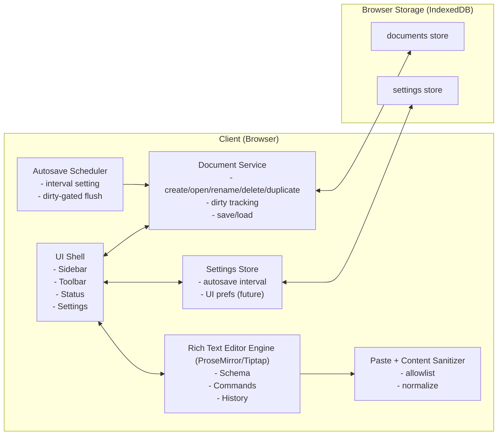
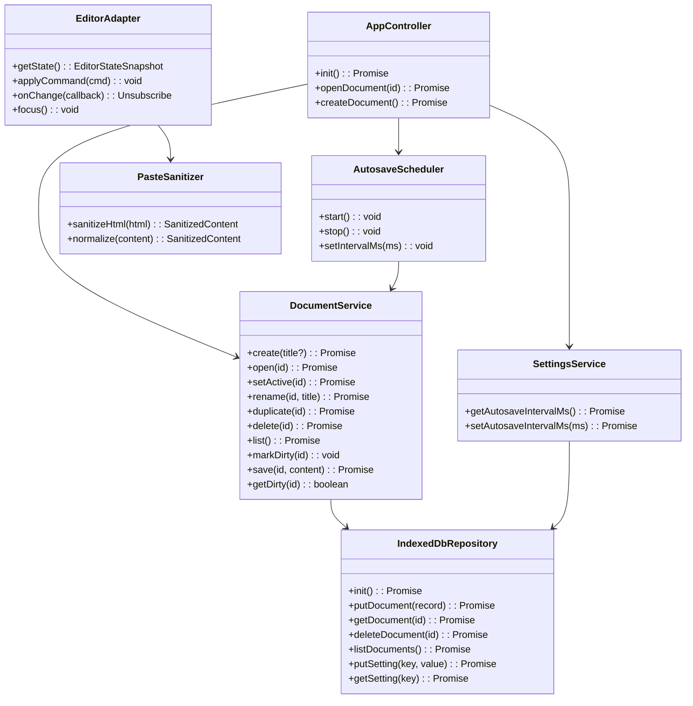
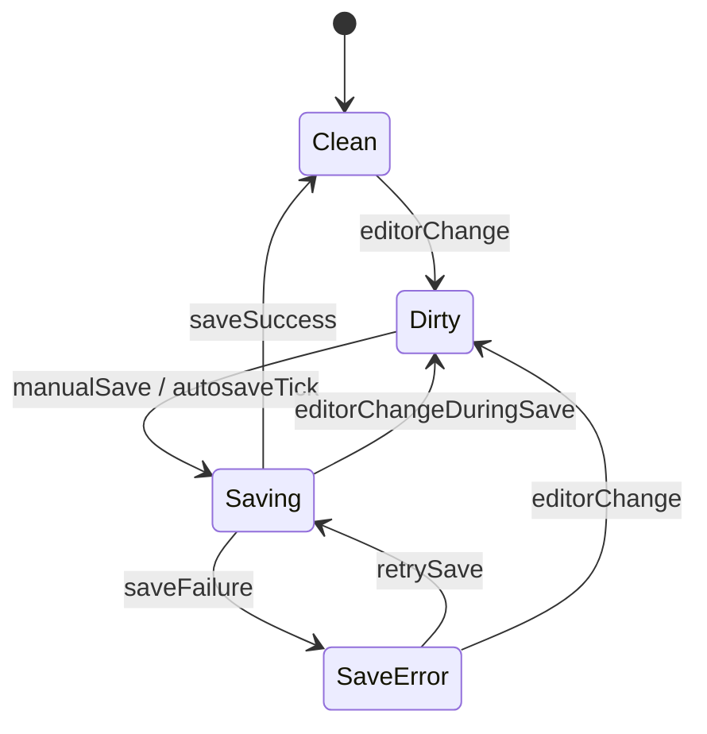
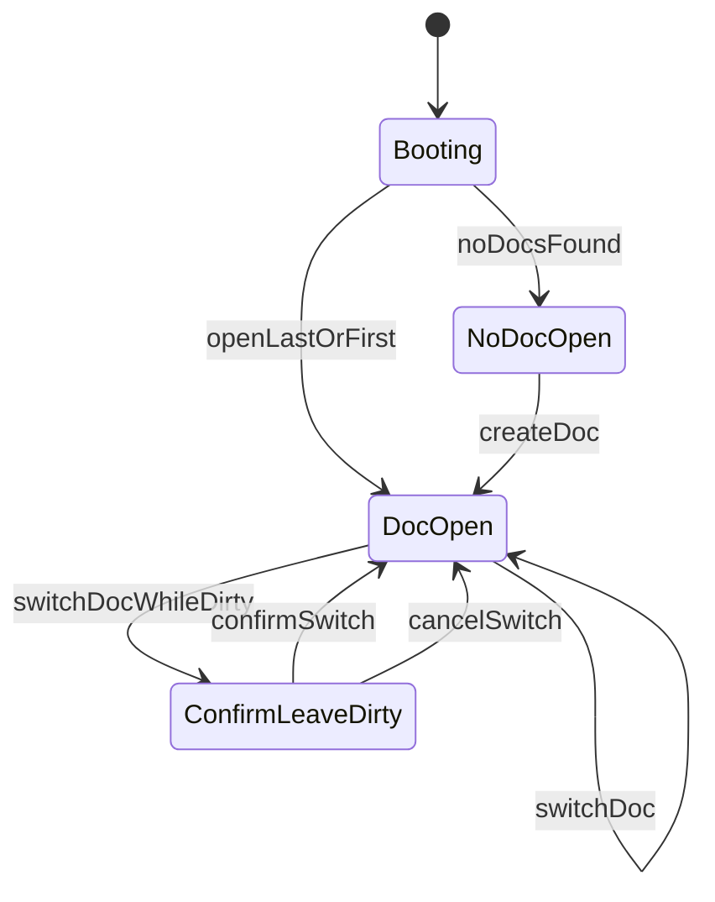
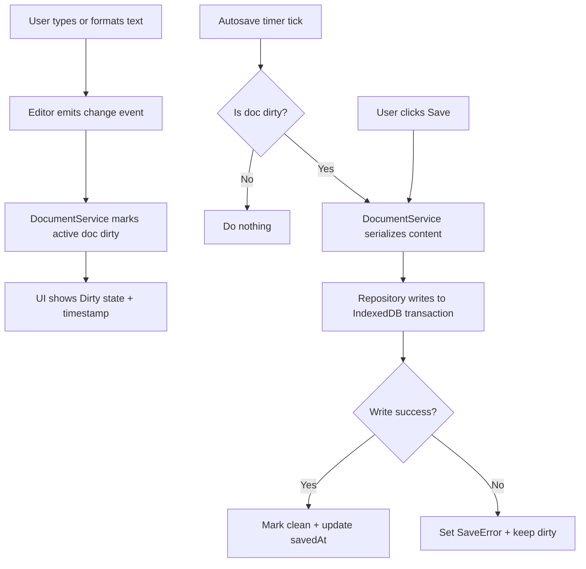

# GlossaDocs — User Story 1 Spec (Basic Editor: Create, Edit, Save)
**User Story**: As a writer, I want a basic document editor where I can create, edit, and save a text document so that I can actually write and return to my work.

**Scope (v1)**: Strictly browser-only (no server). Persistence via IndexedDB. Anonymous usage. In-editor sidebar for multi-document UX. Content is rich-text with basic formatting (bold, italics, font size), formatted paste allowed, undo/redo required, autosave every 10s by default (user-configurable global setting) and manual save button.

---

## Header

### Goals
- Provide a usable, reliable in-browser editor for writing and returning later.
- Support multiple documents with create/open/rename/delete/duplicate.
- Ensure edits persist safely (autosave + manual save), with clear “dirty/saved” state.
- Support basic rich text with scalable internals suitable for later features (language-aware keyboards, collaboration, export, accounts).

### Versioning
- **Application**: GlossaDocs uses **Semantic Versioning**: `MAJOR.MINOR.PATCH`.
- **Storage schema**: IndexedDB uses a required **integer** `dbVersion` for migrations; this is versioned independently of app SemVer.

### Non-Goals (v1)
- No backend, no authentication, no sharing/collaboration.
- No advanced document features (tables, comments, track changes).
- No spellcheck/language tooling changes beyond keyboard behavior (Story 2+).

### Assumptions
- Single-device usage per browser profile (since storage is local).
- Browser supports IndexedDB (modern Chrome/Edge/Firefox/Safari).
- QWERTY physical keyboard assumed for later compose rules; Story 1 does not depend on this.

### Key design decisions (with rationale)
- **Canonical document model = structured JSON (ProseMirror/Tiptap)**: safer to evolve than HTML-only storage; enables clean migrations, future collaboration, and deterministic rendering.
- **Persistence in IndexedDB**: scales better than localStorage for many/larger documents; supports indexed queries for the sidebar list.
- **Stable `DocumentId`**: rename/formatting/editing update the same record; duplicate creates a new `id` with copied content.
- **Dirty gating**: “dirty” means the editor state differs from the last successfully persisted snapshot; autosave/manual save do nothing when clean.
- **Manual save + autosave**: autosave prevents data loss; manual save gives users confidence/control and provides a single “save now” action after errors.

---

## Architecture Diagram

### Where components run
- **Client (Browser)**: Entire application (UI, editor engine, persistence, settings).
- **Storage (Browser IndexedDB)**: Documents + settings (document “metadata” is stored on each document record and indexed for fast listing/sorting).

### Component diagram (runtime + info flow)



### Information flows between components
- **Editor → Document Service**: change events, current doc state, “dirty” transitions.
- **Document Service → IndexedDB**: persist doc records (content + title + timestamps).
- **Settings Store ↔ IndexedDB**: autosave interval read/write (global).
- **Autosave Scheduler → Document Service**: periodic “flush if dirty” trigger.
- **UI ↔ Editor**: user input, selection state, toolbar formatting commands.
- **Paste Sanitizer → Editor**: sanitized slice inserted into editor state.

Rationale:
- Keeping titles/timestamps alongside document content (and indexing them) avoids a second “meta” store while still allowing a fast sidebar list without loading all document bodies.

---

## Class Diagram



---

## List of Classes (Responsibilities)

- **`AppController`**
  - Bootstraps app, loads settings, opens last doc (optional), wires UI.
- **`EditorAdapter`**
  - Thin wrapper around the rich text editor engine (ProseMirror/Tiptap), exposing commands and change events.
- **`DocumentService`**
  - Owns document lifecycle and “dirty/saved” state transitions; provides list/create/open/rename/delete/duplicate; initiates persistence.
  - Stores `inputLocale` on documents (default `en-US` in Story 1; made user-configurable in Story 2).
- **`IndexedDbRepository`**
  - Persistence boundary; hides IndexedDB details (stores, transactions, migrations).
- **`AutosaveScheduler`**
  - Timer-based trigger that asks `DocumentService` to flush the current doc if dirty. Interval is global & user-configurable.
- **`SettingsService`**
  - Loads/saves global app settings (autosave interval in Story 1; extended with `lastUsedLocale` in Story 2 and `keyboardVisible` in Story 3).
- **`PasteSanitizer`**
  - Sanitizes pasted HTML to an allowlisted subset compatible with the editor schema and safe for re-rendering.

---

## State Diagrams

### Document save state (per active document)



### App view state (sidebar + editor)



Notes:
- Because persistence is local and autosave exists, “ConfirmLeaveDirty” may be optional UX; if implemented, it should rely on “dirty” and last-save timestamp.

---

## Flow Chart

### Create/Edit/Autosave/Manual Save



---

## Development Risks and Failures

- **IndexedDB edge cases**: quota exceeded, blocked upgrades, transaction failures.
  - Mitigation: clear error messaging, retry path, graceful fallback (export/download), robust versioned migrations.
- **Rich text complexity**: contenteditable is tricky; direct HTML storage can become brittle.
  - Mitigation: adopt a structured editor engine (ProseMirror/Tiptap) and store canonical JSON doc.
- **Paste handling**: formatted paste can import unexpected HTML.
  - Mitigation: strict allowlist sanitization + schema normalization.
- **Undo/redo correctness**: must integrate with editor history, not custom diffs.
  - Mitigation: use editor engine history plugin; ensure autosave does not reset history.
- **Autosave race conditions**: save in progress while user edits/renames.
  - Mitigation: save immutable snapshots (doc JSON + current title) per flush; track an in-flight save token and queue one additional save if edits occur during a save. Rename updates the same document `id`; the next save persists the new title.

---

## Technology Stack (v1 recommendation)

Because v1 is browser-only but we want scalable internals:
- **Frontend**: React + TypeScript (component model, testability, ecosystem).
- **Editor**: Tiptap (ProseMirror) for schema-based rich text, commands, and history.
- **Persistence**: IndexedDB via `idb` (or equivalent wrapper) for simpler async API and migrations.
- **State management**: lightweight (React context + reducers) or Zustand; keep persistence boundaries explicit.
- **Diagrams/docs**: Markdown + Mermaid.

Deployment note: even browser-only apps are deployed as static assets (S3 + CloudFront) when moving to AWS.

Rationale:
- **Tiptap/ProseMirror**: schema-based documents, commands, and a built-in history model reduce long-term complexity vs ad-hoc HTML from `contenteditable`.
- **IndexedDB**: supports many documents and larger content more reliably than localStorage; async transactions reduce UI jank.

---

## APIs

### External APIs (v1)
- None (no server).

### Internal application APIs (module boundaries)

#### DocumentService (domain API)
- `create(title?: string): Promise<DocumentMeta>`
- `open(id: string): Promise<LoadedDocument>`
- `list(): Promise<DocumentMeta[]>`
- `rename(id: string, title: string): Promise<void>`
- `duplicate(id: string): Promise<DocumentMeta>`
- `delete(id: string): Promise<void>`
- `save(id: string, content: EditorDoc): Promise<void>`
- `setActive(id: string): Promise<void>`

#### SettingsService
- `getAutosaveIntervalMs(): Promise<number>`
- `setAutosaveIntervalMs(ms: number): Promise<void>`

---

## Public Interfaces

These are the “public” interfaces between modules (TypeScript types).

```ts
export type DocumentId = string;
export type LocaleTag = string; // BCP 47, e.g. "en-US"

export type Unsubscribe = () => void;

export interface EditorStateSnapshot {
  // Minimal shape for app-level UI (toolbar state, status, etc.).
  // Concrete representation depends on the editor engine.
  isBoldActive: boolean;
  isItalicActive: boolean;
  // font size at cursor/selection, if applicable; undefined when mixed/unknown
  fontSizePx?: number;
}

export interface DocumentMeta {
  id: DocumentId;
  title: string;
  createdAt: number; // epoch ms
  updatedAt: number; // epoch ms (last edit/change in editor)
  savedAt: number;   // epoch ms (last successful persistence to IndexedDB)
  // Added/used starting Story 2 (language selection). For Story 1-only builds, default to "en-US".
  inputLocale: LocaleTag;
}

// Canonical editor document representation (ProseMirror/Tiptap JSON)
export interface EditorDoc {
  type: string;
  content?: unknown[];
  attrs?: Record<string, unknown>;
}

export interface LoadedDocument {
  meta: DocumentMeta;
  doc: EditorDoc;
}

export interface DocumentRecord extends DocumentMeta {
  // canonical content; can be re-hydrated into the editor state
  doc: EditorDoc;
  // optional denormalized HTML for fast export/preview (future)
  htmlCache?: string;
  schemaVersion: number;
}

export interface AppSettings {
  autosaveIntervalMs: number;
  // Added/used starting Story 2. For Story 1-only builds, default to "en-US".
  lastUsedLocale: LocaleTag;
  // Added/used starting Story 3. For Story 1-only builds, default to true.
  keyboardVisible: boolean;
}

export interface SanitizedContent {
  // EditorDoc-compatible structure produced by paste pipeline
  docSlice: unknown;
}
```

Rationale (formatting model choice):
- Store **canonical structured JSON** (`EditorDoc`) rather than raw HTML for durability, migrations, and future collaboration/export.
- HTML can be derived as needed; storing HTML-only tends to create sanitization/migration pitfalls.

---

## Data Schemas

### IndexedDB database
- **DB name**: `glossadocs`
- **dbVersion**: `1` (IndexedDB integer; increment for migrations)

### Object stores
- **`documents`** (key: `id`)
  - Value: `DocumentRecord`
  - Includes: `title`, timestamps, **`inputLocale`** (default `en-US`), and canonical editor content (`doc`)
  - Indexes:
    - `updatedAt` (for sorting recents)
    - `title` (for searching/filtering)
- **`settings`** (key: `key`)
  - Value: `{ key: string, value: any }`

### Default values
- New document title: `Untitled Document` (or `Untitled Document (2)` when collision in UI list)
- Default autosave interval: `10000` ms
- New document initial content: empty ProseMirror doc (schema-compliant root)
- Document ids: generate a new unique `DocumentId` (e.g., UUID v4) for each create/duplicate.
- Default document input locale: `en-US` (Story 2 uses this as migration/backfill default)
- Default last used locale: `en-US` (used starting Story 2)
- Default keyboard visibility: `true` (used starting Story 3)

Rationale:
- Sidebar listing should load only `DocumentMeta` (via indexes) and avoid loading full document bodies for every record to keep the UI fast with many documents.

---

## Security and Privacy

### Threat model (v1)
- No server: primary risks are **XSS within the client**, data exposure via shared machine/browser profile, and malicious pasted content.

### Controls
- **Sanitize pasted HTML** to an allowlisted set of tags/attrs matching the editor schema.
- **Do not execute scripts** from user content; never allow `on*` event attributes, `script`, `style` injection.
- **Content rendering** should use the editor’s safe rendering pipeline, not `dangerouslySetInnerHTML` for arbitrary HTML.
- **Local data privacy**: clearly communicate that docs are stored in the browser on that device; provide a “Clear all local documents” action (optional but recommended).

Rationale:
- “Allow formatted paste” is compatible with security if clipboard HTML is converted into the editor’s schema via an allowlist (e.g., strong/em + font-size marks) and everything else is dropped.

### Data retention
- Documents persist until user deletes them or clears browser storage.

---

## Risks to Completion

- **Choosing an editor engine**: integrating ProseMirror/Tiptap early reduces later refactor risk but has a learning curve.
- **Schema evolution**: once documents are saved, schema changes require migrations.
  - Mitigation: store `schemaVersion` and write migration functions early.
- **Cross-browser consistency**: clipboard behavior differs by browser.
  - Mitigation: test paste + undo/redo in Chrome/Edge + one secondary browser.
- **Performance with many docs**: listing/searching may degrade if metadata isn’t indexed.
  - Mitigation: store metadata indexes and keep doc list records small (no full doc load for sidebar list).

