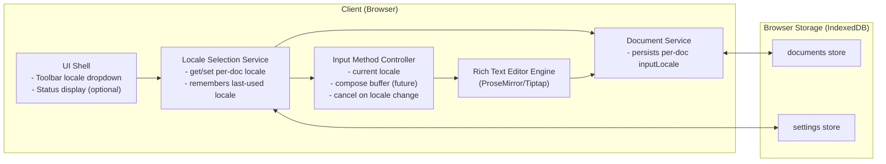
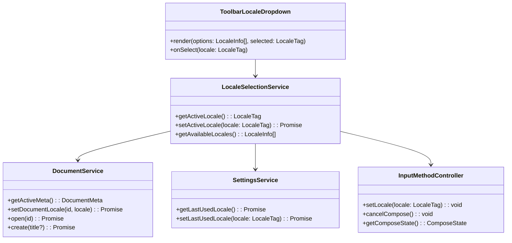
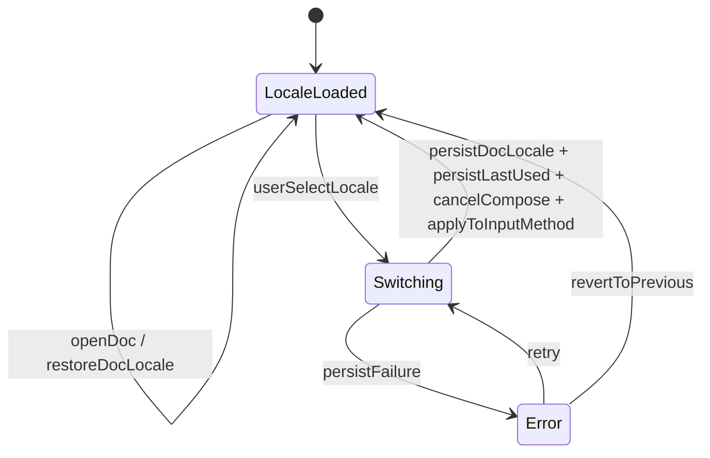
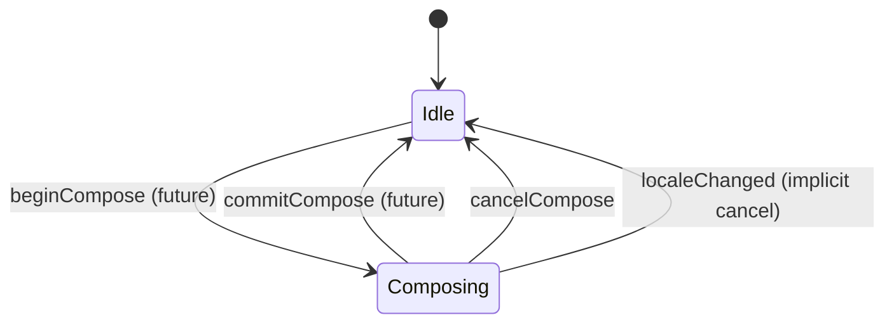
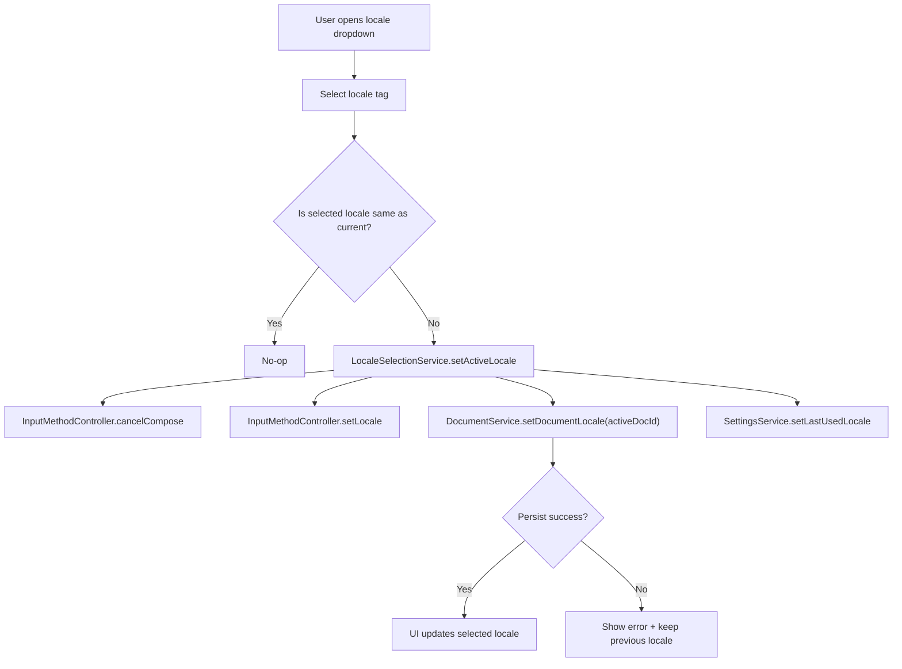
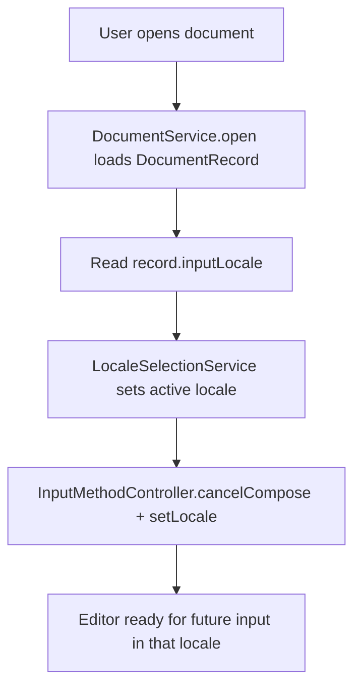

# GlossaDocs — User Story 2 Spec (Per-Document Language Selection)
**User Story**: As a user, I want to select the language I intend to type in so that the editor can adapt its behavior to my intent.

**Scope (v1)**: Browser-only. Language selection is **per document**, uses real **BCP 47 locale tags** (e.g., `en-US`, `de-DE`, `ru-RU`), affects **future input only** (no retroactive changes), and is quickly changeable via a **toolbar dropdown** (hotkey placeholder). The app remembers the **last selected language** (used as default for newly created documents). Switching language **cancels any in-progress compose sequence**.

**Initial selectable locales (proof of concept)**:
- `en-US` (English — United States) **default**
- `de-DE` (German — Germany)
- `ru-RU` (Russian — Russia)

---

## Header

### Goals
- Allow users to select an intended input language per document using BCP 47 locale tags.
- Persist the selected locale with the document so reopening restores the same intent.
- Support fast switching during writing (dropdown now; hotkey reserved for later).
- Ensure switching languages does not corrupt input: it cancels any in-progress compose sequence and only affects future input.

### Key design decisions (with rationale)
- **Use BCP 47 locale tags** (`en-US`, `de-DE`, `ru-RU`): standard, extensible, and compatible with future features (spellcheck, fonts, directionality, IME).
- **Per-document locale**: multilingual writers often keep different documents in different languages; storing intent with the doc avoids “global toggle surprise.”
- **Remember last-used locale globally**: makes creating multiple documents in the same language convenient without extra clicks.
- **Language affects only future input**: prevents unexpected transformations of existing content and keeps behavior predictable.
- **Switch cancels compose sequence**: avoids ambiguous partial sequences crossing language boundaries.

### Non-Goals (v1)
- No on-screen keyboard requirements (Story 3).
- No spellcheck, grammar, or locale-driven formatting changes.
- No automatic language detection.
- No IME for Mandarin yet (later).

### Assumptions
- Documents are stored locally in IndexedDB (from Story 1).
- “Compose sequence” refers to the input-method layer (even if full compose rules land later); we still define cancellation semantics now.

---

## Architecture Diagram

### Where components run
- **Client (Browser)**: UI, editor, language selection logic, compose/input-method controller, persistence.
- **Storage (Browser IndexedDB)**: documents (including `inputLocale`) and settings (including `lastUsedLocale`).

### Component diagram (runtime + info flow)



### Information flows between components
- **UI → Locale Selection Service**: user picks a locale in dropdown.
- **Locale Selection Service → Document Service**: update active document’s `inputLocale` and persist it.
- **Locale Selection Service ↔ IndexedDB settings**: read/write `lastUsedLocale`.
- **Locale Selection Service → Input Method Controller**: set `currentLocale`; triggers cancellation of compose buffer.
- **Input Method Controller → Editor**: influences how future keystrokes are interpreted (compose rules later), without retroactively changing document content.
- **Document switch → UI**: opening a different document refreshes the dropdown selection to that document’s `inputLocale`.

Rationale:
- Keeping locale selection separate from the editor engine isolates “input intent” concerns and makes it easier to add keyboards/compose/IME later without rewriting document persistence.

---

## Class Diagram



Notes:
- `LocaleSelectionService.setActiveLocale` updates three things as one user-visible action: active doc’s `inputLocale`, global `lastUsedLocale`, and current input-method locale (which cancels compose). Persistence can be done via a single IndexedDB transaction spanning the `documents` and `settings` stores.

---

## List of Classes (Responsibilities)

- **`LocaleSelectionService`**
  - Source of truth for the active document’s selected locale.
  - Exposes available locales list for UI.
  - Persists per-document `inputLocale` via `DocumentService`.
  - Persists global `lastUsedLocale` via `SettingsService`.
  - Notifies `InputMethodController` of locale changes.

- **`InputMethodController`**
  - Holds current locale for future input interpretation.
  - Manages compose buffer state (even if compose is “future,” cancellation semantics are defined now).
  - Ensures locale changes cancel in-progress compose sequences.

- **`ToolbarLocaleDropdown`**
  - UI control for selecting locale quickly.
  - Displays current locale tag and human-readable label (e.g., “German (Germany)”).
  - Includes a placeholder hint for a future hotkey.

- **`DocumentService`**
  - Loads/saves per-document locale (`inputLocale`) as part of document metadata.
  - Guarantees that opening a document restores its `inputLocale` (and thus the input-method locale).

- **`SettingsService`**
  - Stores global preference `lastUsedLocale` for defaulting new documents.

---

## State Diagrams

### Locale selection state (per active document)



### Compose state (input method layer)



---

## Flow Chart

### User selects a locale from toolbar



### Open document restores its locale



---

## Development Risks and Failures

- **Locale-tag correctness and display**: users see tags and names; incorrect mapping is confusing.
  - Mitigation: keep a `LocaleInfo` registry (tag + label + example) in code; validate tags as BCP 47.
- **Per-document vs global confusion**: users may expect global language.
  - Mitigation: display locale in toolbar clearly; when switching documents, visibly update locale selection.
- **Race conditions with autosave**: locale changes persist while editor is saving content.
  - Mitigation: locale update is metadata-only on the same record; use a single write transaction per update or a simple “last write wins” rule on `inputLocale`.
- **Compose cancellation semantics**: later compose implementation must honor cancellation rules.
  - Mitigation: define `InputMethodController.cancelCompose()` now and require it be called on locale change.

---

## Technology Stack

Same as Story 1:
- **Frontend**: React + TypeScript
- **Editor**: Tiptap (ProseMirror)
- **Persistence**: IndexedDB via `idb`
- **Diagrams/docs**: Markdown + Mermaid

Additional (optional) utilities:
- **Locale parsing/validation**: simple BCP 47 validation helper (lightweight), or rely on browser `Intl` capabilities for display names where available.

---

## APIs

### External APIs (v1)
- None (no server).

### Internal application APIs (module boundaries)

#### LocaleSelectionService
- `getAvailableLocales(): LocaleInfo[]`
- `getActiveLocale(): LocaleTag`
- `setActiveLocale(locale: LocaleTag): Promise<void>`

#### DocumentService (additions to Story 1)
- `setDocumentLocale(id: DocumentId, locale: LocaleTag): Promise<void>`

#### SettingsService (additions)
- `getLastUsedLocale(): Promise<LocaleTag>`
- `setLastUsedLocale(locale: LocaleTag): Promise<void>`

#### InputMethodController
- `setLocale(locale: LocaleTag): void`
- `cancelCompose(): void`
- `getComposeState(): ComposeState`

Hotkey placeholder:
- Define an internal command name (unbound in v1): `language.switch.next` (cycles through available locales).

---

## Public Interfaces

```ts
export type DocumentId = string;
export type LocaleTag = string; // must be a valid BCP 47 tag (e.g., "en-US")

export interface LocaleInfo {
  tag: LocaleTag;
  label: string;   // e.g., "German (Germany)"
  nativeLabel?: string; // e.g., "Deutsch (Deutschland)" (optional)
}

export type ComposeState = "idle" | "composing";

// Canonical editor doc shape is defined in Story 1 (ProseMirror/Tiptap JSON).
// Story 2 treats it as opaque.
export type EditorDoc = unknown;

export interface DocumentMeta {
  id: DocumentId;
  title: string;
  createdAt: number;
  updatedAt: number;
  savedAt: number;
  inputLocale: LocaleTag; // per-document language intent for input
}

export interface DocumentRecord extends DocumentMeta {
  // See Story 1 for full document content schema (editor JSON, schemaVersion, etc.).
  // Story 2 adds/relies on `inputLocale` existing on the stored record.
  doc: EditorDoc;
  schemaVersion: number;
}

export interface LoadedDocument {
  meta: DocumentMeta;
  doc: EditorDoc;
}

export interface AppSettings {
  autosaveIntervalMs: number;
  lastUsedLocale: LocaleTag; // used as default for new docs
  // Added/used starting Story 3. If absent (older db), default to true.
  keyboardVisible?: boolean;
}
```

Rationale:
- `inputLocale` lives on document metadata because language intent is a property of the document, not just the current session.
- `lastUsedLocale` is global to streamline creating multiple docs in the same language.

---

## Data Schemas

### IndexedDB database
- **DB name**: `glossadocs`
- **dbVersion**: integer used for migrations.
  - If Story 1 ships first at `dbVersion = 1`, then Story 2 bumps to `dbVersion = 2` to add `inputLocale` and `lastUsedLocale`.

### Schema changes relative to Story 1
- `documents` store: add `inputLocale` to stored `DocumentRecord` / metadata.
- `settings` store: add `lastUsedLocale`.

### Settings keys (suggested)
- `lastUsedLocale`: `LocaleTag` (e.g., `"de-DE"`)

### Default values
- Default document locale on first run: `en-US`
- Default `lastUsedLocale` on first run: `en-US`
- New documents default to `settings.lastUsedLocale` (falls back to `en-US`)

Migration note:
- Existing documents created before Story 2: during migration, backfill `inputLocale = "en-US"`.

---

## Security and Privacy

### Threat model additions (v1)
- Minimal: selected locales and preferences are stored locally; no network transmission in v1.

### Controls
- Treat locale tags as **data**, not executable code.
- UI should not directly inject user-provided strings as HTML (standard React escaping suffices).

### Privacy
- Locale selection may indirectly reveal user language preferences, but remains local to the browser profile in v1.

---

## Risks to Completion

- **Spec/implementation mismatch with future keyboard work**: Story 2 must not hardcode assumptions that break Story 3.
  - Mitigation: keep `LocaleSelectionService` and `InputMethodController` interfaces generic; keyboard mapping lives elsewhere later.
- **Scaling locale registry**: adding many locales later can bloat UI and testing.
  - Mitigation: design `LocaleInfo` registry + filtering/search (future), and keep internal IDs stable (BCP 47 tags).
- **Migration discipline**: adding `inputLocale` requires IndexedDB version bump and safe backfill.
  - Mitigation: require migration tests and a backfill to `en-US`.

