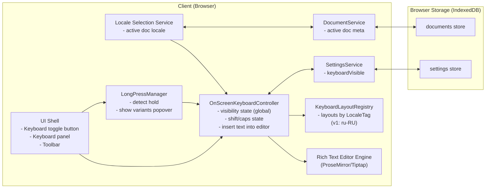
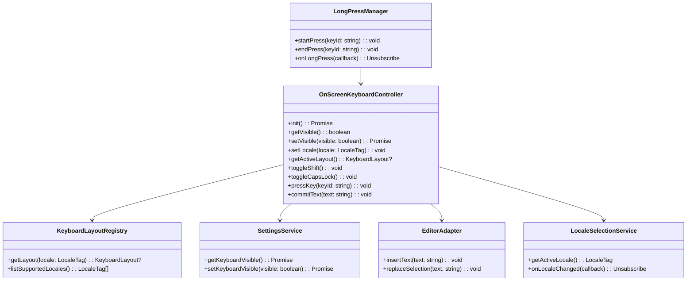
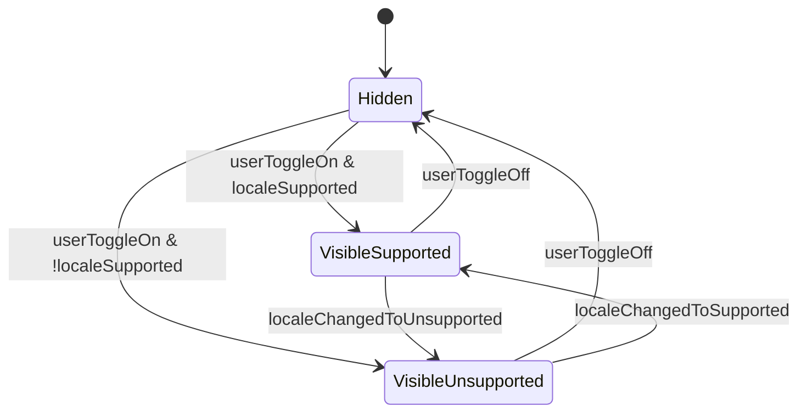
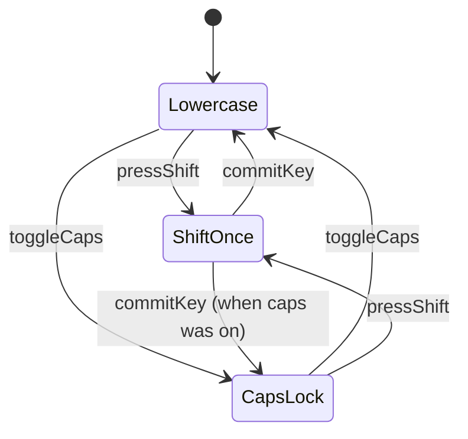
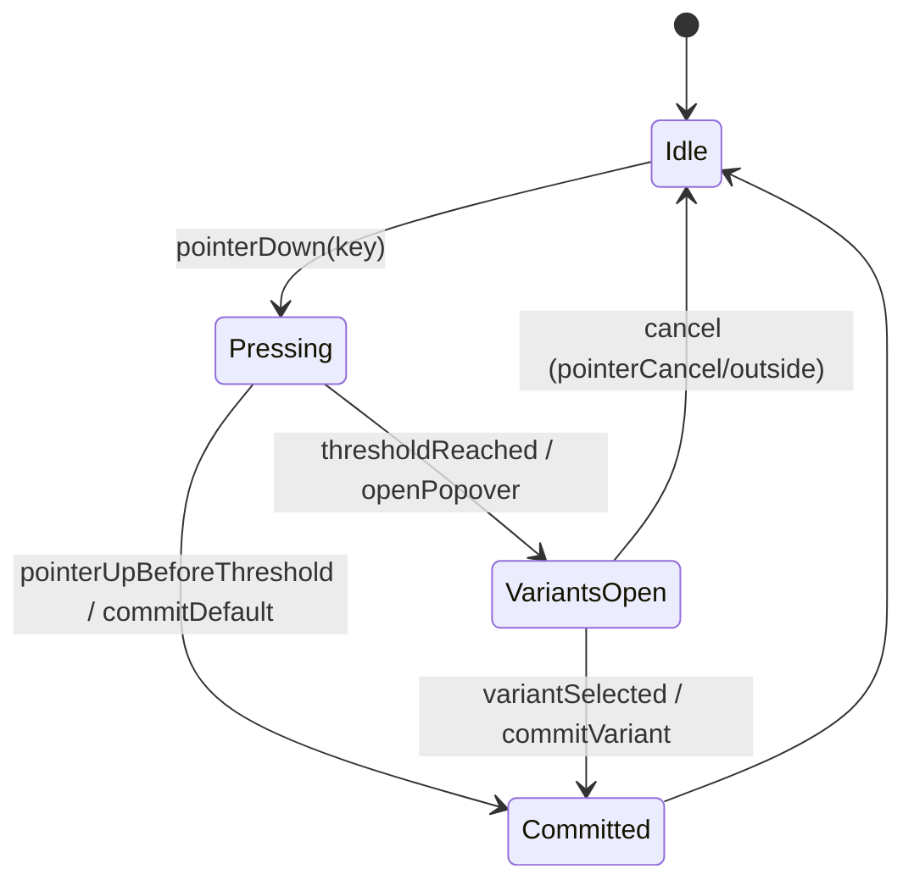
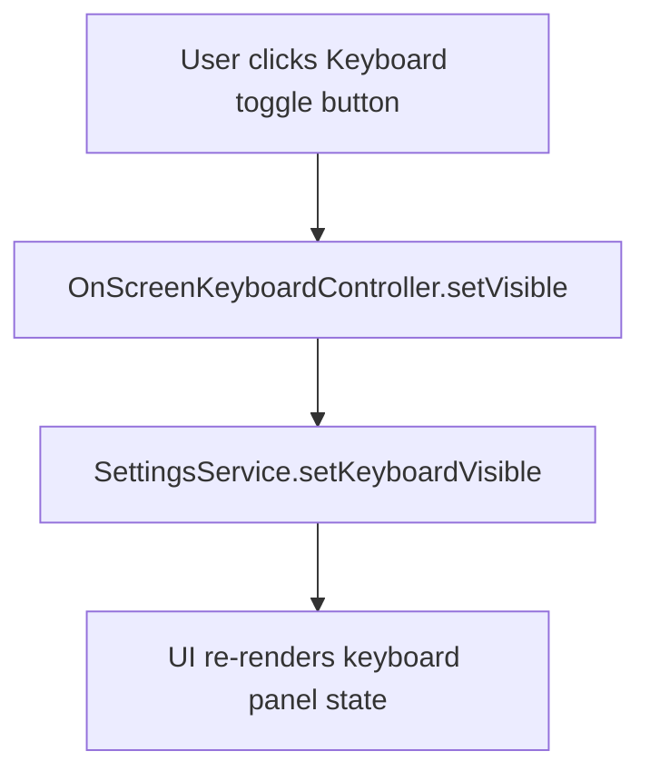
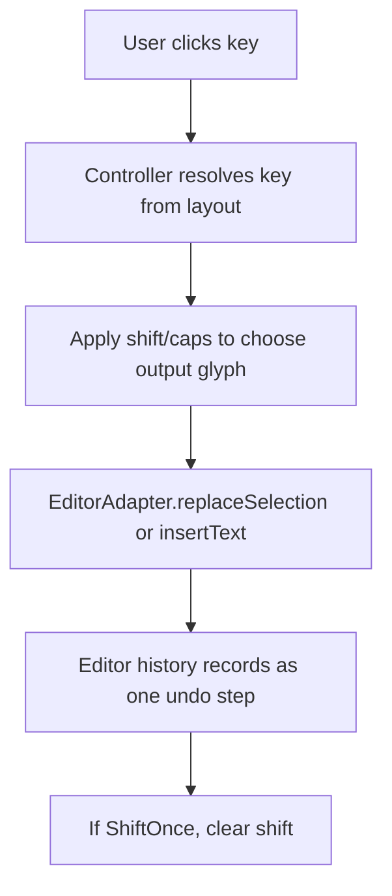
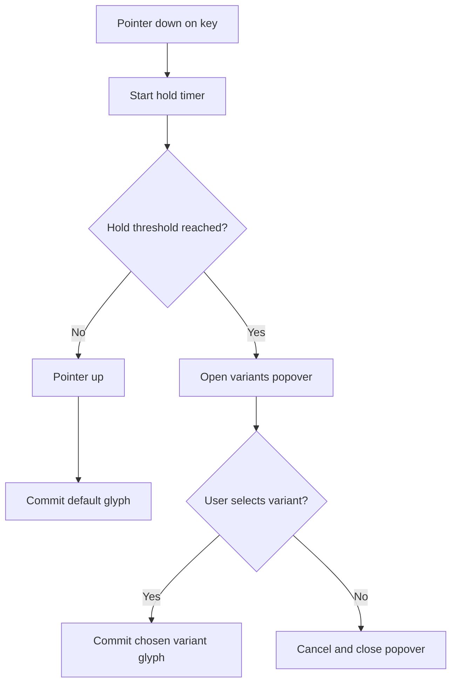

# GlossaDocs — User Story 3 Spec (On-Screen Keyboard for Non‑Latin Alphabet)
**User Story**: As a multilingual writer, I want an integrated on-screen keyboard for a non-Latin alphabet so that I can type special characters directly inside the editor.

**Scope (v1)**: Browser-only. Implement **Russian Cyrillic** first (locale `ru-RU`) using a **phonetic mapping** on-screen keyboard. Keyboard is **on by default** and can be toggled via a **button**; visibility is a **global** setting. Keyboard supports **uppercase** (Shift/Caps behavior), **punctuation**, and **long-press variants**. Clicking a key inserts at the cursor / replaces selection and integrates with **undo/redo** as a single operation.

---

## Header

### Goals
- Provide an integrated on-screen keyboard for **Russian Cyrillic** inside the editor.
- Allow users to toggle the keyboard (global visible/hidden), with default **visible**.
- Make typing efficient for non-native layouts via **phonetic mapping** (not ЙЦУКЕН).
- Support essential typing mechanics: uppercase, punctuation, long-press variants.
- Ensure keyboard input behaves like normal typing: inserts at cursor, replaces selection, participates in undo/redo.

### Key design decisions (with rationale)
- **Show keyboard only when the active document locale is supported** (v1: `ru-RU`) and the global setting is enabled:
  - Rationale: avoids UI clutter for users writing in `en-US`/`de-DE` while still being “on by default” for the target locale.
- **Phonetic mapping vs ЙЦУКЕН**:
  - Rationale: users without a Russian OS layout can still type; users who know ЙЦУКЕН likely already have a native layout available.
- **Data-driven layout registry** (keys/variants in configuration, not hardcoded in UI):
  - Rationale: supports adding more languages later without rewriting components.
- **Long-press variants** implemented as a popover anchored to the pressed key:
  - Rationale: matches familiar mobile keyboard behavior and reduces toolbar/extra-key clutter.

### Non-Goals (v1)
- No Latin + diacritics keyboard (future story).
- No compose-chord keybinds (future; Story 3 is about on-screen entry).
- No IME for Mandarin (future).
- No backend sync/sharing.

### Assumptions
- Story 2 exists: each document has `inputLocale` (BCP 47 tag) and the app can read the active document locale.
- Keyboard visibility preference is global (stored in IndexedDB settings).

---

## Architecture Diagram

### Where components run
- **Client (Browser)**: UI, editor, keyboard UI, input method controller, locale selection, persistence.
- **Storage (Browser IndexedDB)**: settings (keyboard visibility) and documents (content + per-doc locale).

### Component diagram (runtime + info flow)



### Information flows between components
- **Document open/switch → Locale Selection Service**: active document locale changes.
- **Locale Selection Service → Keyboard Controller**: provides current `LocaleTag` so controller can select a layout (or disable keyboard UI when unsupported).
- **UI → Keyboard Controller**: toggle keyboard visible/hidden; press Shift/Caps; click keys; select long-press variants.
- **Keyboard Controller → Editor**: inserts characters via editor command/transaction (single undo step).
- **Keyboard Controller ↔ SettingsService ↔ IndexedDB**: read/write global `keyboardVisible`.
- **Keyboard Controller → KeyboardLayoutRegistry**: fetch layout for `ru-RU`.
- **LongPressManager → UI/Controller**: on hold, show variants and commit chosen variant.

Rationale:
- Keeping keyboard insertion logic in a controller ensures editor transactions/undo integration are correct and consistent across click/variant input.

---

## Class Diagram



---

## List of Classes (Responsibilities)

- **`OnScreenKeyboardController`**
  - Owns keyboard visibility (global), current locale, selected layout, and shift/caps state.
  - Converts “key pressed” into text insertion via the editor adapter.
  - Persists global visibility preference.
  - Ensures each committed key/variant is a single undo step.

- **`KeyboardLayoutRegistry`**
  - Stores keyboard layouts keyed by locale tag (v1: `ru-RU` only).
  - Layout is declarative: rows of keys; each key has labels and optional variants.

- **`LongPressManager`**
  - Handles pointer/touch events and a configurable hold threshold.
  - Emits long-press events to open the variants popover.

- **`SettingsService`**
  - Reads/writes `keyboardVisible` in IndexedDB settings store.

- **`LocaleSelectionService`**
  - Provides active document locale (per Story 2).
  - Notifies controller when the active locale changes so the keyboard can update.

- **`EditorAdapter`**
  - Boundary to editor engine; provides safe insertion operations that respect selection and history.

---

## State Diagrams

### Keyboard visibility + support gating



Notes:
- UI may choose not to render the panel in `VisibleUnsupported` (instead show a small message like “Keyboard not available for this language yet”), but the global setting still remains “on.”

### Shift/Caps behavior



### Long-press variants



---

## Flow Chart

### Toggle keyboard (global)



### Click a key (default character)



### Long-press to select variant



---

## Development Risks and Failures

- **Undo/redo integration**: insertion must be one step, and variants must not fragment history.
  - Mitigation: commit via a single editor transaction/command per key press.
- **Long-press UX across devices**: mouse vs touch behavior differs; accidental long-presses can annoy.
  - Mitigation: set a sensible threshold (e.g., 350–500ms), cancel on pointer move, and test on touch emulation.
- **Phonetic layout expectations**: users may disagree on mapping choices.
  - Mitigation: keep mapping data-driven and document it; plan future customization.
- **Punctuation + Cyrillic edge cases**: ensure output uses correct characters (e.g., `ё`) and doesn’t break fonts.
  - Mitigation: include `ё` in layout (either dedicated key or variant) and rely on Unicode text insertion.
- **Supported-locale gating**: must not show a broken keyboard for unsupported locales.
  - Mitigation: controller returns `null` layout when unsupported; UI handles gracefully.

---

## Technology Stack

Same as Stories 1–2:
- **Frontend**: React + TypeScript
- **Editor**: Tiptap (ProseMirror)
- **Persistence**: IndexedDB via `idb`
- **Diagrams/docs**: Markdown + Mermaid

Additional UI utilities (optional):
- A popover/portal utility for rendering variants above the keyboard (e.g., Headless UI or a small custom component).

---

## APIs

### External APIs (v1)
- None (no server).

### Internal application APIs (module boundaries)

#### OnScreenKeyboardController
- `init(): Promise<void>`
- `getVisible(): boolean`
- `setVisible(visible: boolean): Promise<void>`
- `setLocale(locale: LocaleTag): void`
- `getActiveLayout(): KeyboardLayout | null`
- `toggleShift(): void`
- `toggleCapsLock(): void`
- `pressKey(keyId: string): void` (commits default glyph)
- `commitText(text: string): void` (commit arbitrary text, e.g., variant)

#### KeyboardLayoutRegistry
- `getLayout(locale: LocaleTag): KeyboardLayout | null`
- `listSupportedLocales(): LocaleTag[]` (v1 returns `["ru-RU"]`)

#### SettingsService (additions)
- `getKeyboardVisible(): Promise<boolean>`
- `setKeyboardVisible(visible: boolean): Promise<void>`

#### LongPressManager
- `startPress(keyId: string): void`
- `endPress(keyId: string): void`
- `onLongPress(cb: (keyId: string) => void): Unsubscribe`

---

## Public Interfaces

```ts
export type LocaleTag = string; // BCP 47, e.g. "ru-RU"
export type DocumentId = string;
export type Unsubscribe = () => void;

export interface KeyboardLayout {
  locale: LocaleTag;          // "ru-RU"
  displayName: string;        // "Russian (phonetic)"
  rows: KeyboardRow[];
}

export type KeyboardRow = KeyboardKey[];

export interface KeyboardKey {
  id: string;                 // stable identifier for events/variants
  kind: "char" | "action";
  // For kind="char"
  output?: KeyOutput;
  // Optional long-press variants (for kind="char")
  variants?: KeyOutput[];
  // For kind="action" (Shift/Caps/Backspace/etc.)
  action?: "shift" | "caps" | "backspace" | "enter" | "space";
  label: string;              // UI label (e.g., "A", "Shift", "Space")
}

export interface KeyOutput {
  lower: string;              // output when lowercase
  upper: string;              // output when uppercase
}

export interface KeyboardState {
  visible: boolean;           // global
  shift: boolean;             // one-shot
  capsLock: boolean;
  activeLocale: LocaleTag;
  activeLayoutLocale?: LocaleTag; // undefined when unsupported
}

export interface AppSettings {
  autosaveIntervalMs: number;
  lastUsedLocale: LocaleTag;
  keyboardVisible: boolean;   // global keyboard panel toggle
}
```

Rationale:
- A `KeyboardLayout` is declarative and independent of UI; it scales to additional languages and variant sets without redesign.

---

## Data Schemas

### IndexedDB database
- **DB name**: `glossadocs`
- **dbVersion**: integer used for migrations.
  - If Story 2 ships at `dbVersion = 2`, then Story 3 likely bumps to `dbVersion = 3` to add `keyboardVisible` to settings.

### Schema changes relative to Story 2
- `settings` store: add `keyboardVisible: boolean`

### Settings keys (suggested)
- `keyboardVisible`: `boolean` (default `true`)

### Default values
- `keyboardVisible = true`
- When `keyboardVisible = true`, keyboard panel renders only if the active document locale has a supported layout (v1: `ru-RU`).

---

## Security and Privacy

### Threat model additions (v1)
- Minimal: keyboard interactions are local UI events; no network.
- Primary risks remain XSS via rich text content (handled in Story 1); keyboard does not introduce new HTML injection surfaces if it inserts plain Unicode text.

### Controls
- Treat layout data as trusted application code (not user-provided) in v1.
- Insert only **plain text** into the editor via editor commands (no HTML insertion).
- Ensure variants popover content is rendered as text (no HTML injection).

### Privacy
- Keyboard visibility preference is stored locally; it may reveal that a user uses non-Latin input, but remains on-device only in v1.

---

## Risks to Completion

- **Layout correctness and user acceptance**: phonetic mapping choices can be contentious.
  - Mitigation: document the mapping and keep it configurable/data-driven for future customization.
- **Cross-platform pointer handling**: long-press must work on mouse and touch without breaking click.
  - Mitigation: implement with Pointer Events, with clear cancellation rules and a tunable threshold.
- **Editor integration complexity**: ensuring single-step undo and correct selection replacement can be subtle.
  - Mitigation: implement insertion exclusively through the editor engine’s transaction APIs and add focused tests for selection/undo.

